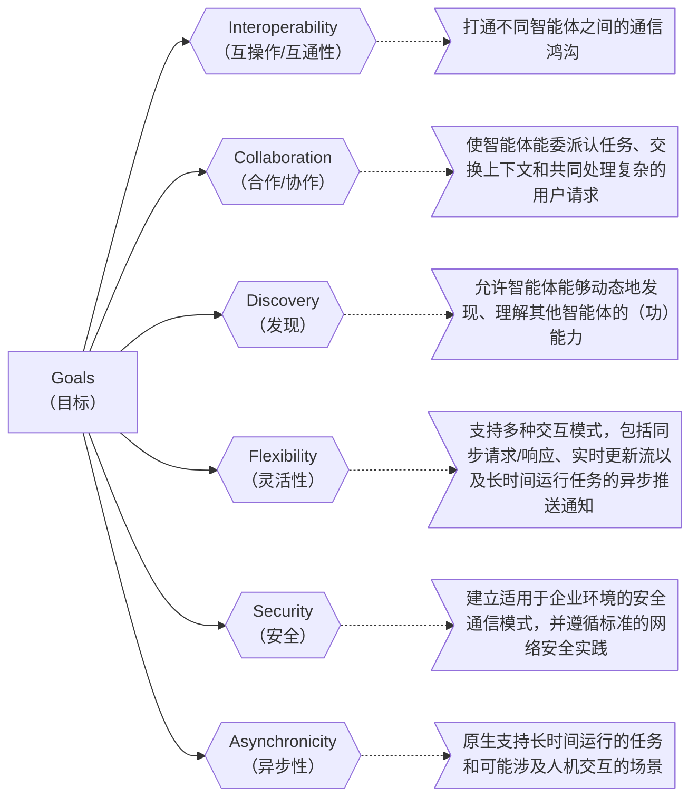
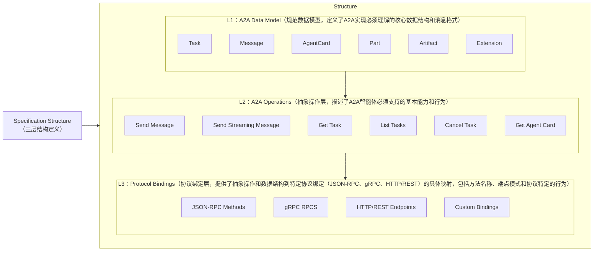
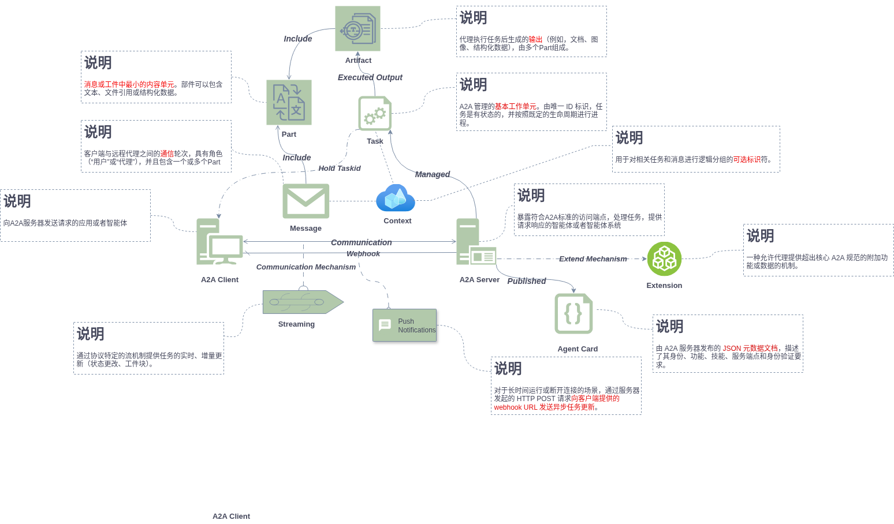

# Agent2Agent Protocol (A2A)

> Agent2Agent (A2A) 协议是一个开放标准，旨在促进独立、可能不透明的 AI 代理系统之间的通信和互操作性。

```mermaid
flowchart LR
    A["Goals\n（目标）"]
    A --> A1{{"Interoperability\n（互操作/互通性）"}} -.-> A11>"打通不同智能体之间的通信鸿沟"]
    A --> A2{{"Collaboration \n（合作/协作）"}} -.-> A21>"使智能体能委派认任务、交换上下文和共同处理复杂的用户请求"]
    A --> A3{{"Discovery \n（发现）"}} -.-> A31>"允许智能体能够动态地发现、理解其他智能体的（功）能力"]
    A --> A4{{"Flexibility \n （灵活性）"}} -.-> A41>"支持多种交互模式，包括同步请求/响应、实时更新流以及长时间运行任务的异步推送通知"]
    A --> A5{{"Security \n（安全）"}} -.-> A51>"建立适用于企业环境的安全通信模式，并遵循标准的网络安全实践"]
    A --> A6{{"Asynchronicity \n（异步性）"}} -.-> A61>"原生支持长时间运行的任务和可能涉及人机交互的场景"]
```

```mermaid
---
协议结构
---

flowchart LR
    A["Specification Structure \n（三层结构定义）"]
    subgraph Structure
        direction TB
        subgraph L3 ["L3：Protocol Bindings（协议绑定层，提供了抽象操作和数据结构到特定协议绑定（JSON-RPC、gRPC、HTTP/REST）的具体映射，包括方法名称、端点模式和协议特定的行为）"]
            direction TB
            LC1["JSON-RPC Methods"]
            LC2["gRPC RPCS"]
            LC3["HTTP/REST Endpoints"]
            LC4["Custom Bindings"]
        end
        subgraph L2 ["L2：A2A Operations（抽象操作层，描述了A2A智能体必须支持的基本能力和行为）"]
            direction TB
            LB1["Send Message"]
            LB2["Send Streaming Message"]
            LB3["Get Task"]
            LB4["List Tasks"]
            LB5["Cancel Task"]
            LB6["Get Agent Card"]
        end
        subgraph L1 ["L1：A2A Data Model（规范数据模型，定义了A2A实现必须理解的核心数据结构和消息格式）"]
            direction TB
            LA1["Task"]
            LA2["Message"]
            LA3["AgentCard"]
            LA4["Part"]
            LA5["Artifact"]
            LA6["Extension"]
        end
        L1 --> L2 --> L3
    end

    A --> Structure
```

