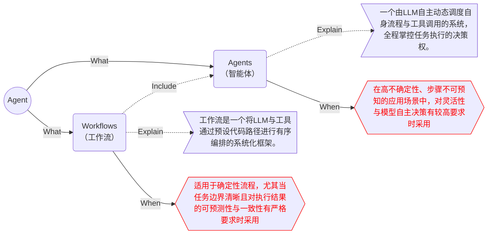
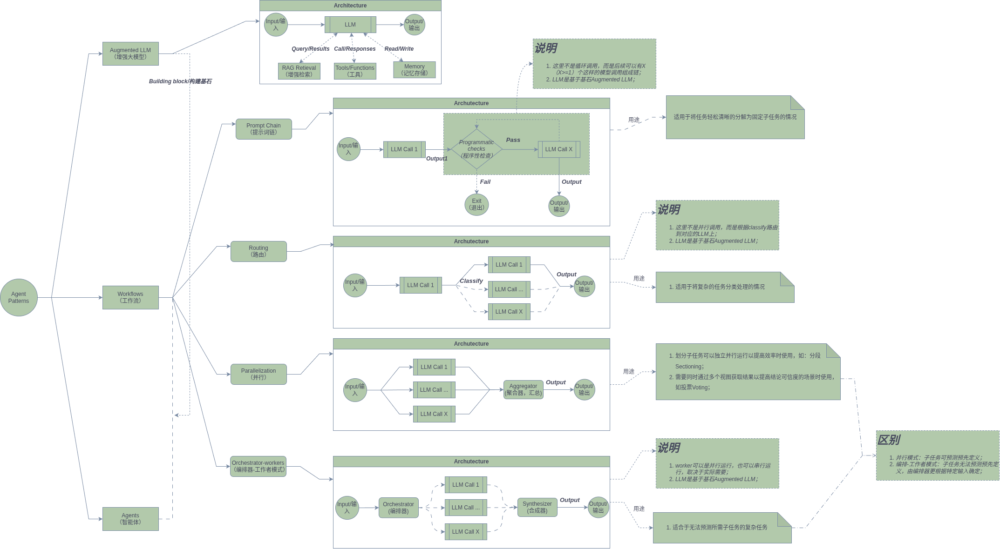

# Agent（智能体）

> Source：[https://www.anthropic.com/engineering/building-effective-agents](https://www.anthropic.com/engineering/building-effective-agents)

```mermaid
flowchart LR
    A(("Agent"))
    A -->|What| A1("Agents \n（智能体）")
    A -->|What| A2("Workflows \n （工作流）")
    A1 -.->|Explain| A11>"一个由LLM自主动态调度自身流程与工具调用的系统，全程掌控任务执行的决策权。"]
    A1 -->|When| A12{{"在高不确定性、步骤不可预知的应用场景中，对灵活性与模型自主决策有较高要求时采用"}}
    A2 -.->|Explain| A21>"工作流是一个将LLM与工具通过预设代码路径进行有序编排的系统化框架。"]
    A2 -->|When| A22{{"适用于确定性流程，尤其当任务边界清晰且对执行结果的可预测性与一致性有严格要求时采用"}}
    A2-.->|Include|A1
    classDef required color: red, stroke: red
    classDef optional stroke-dasharray: 5 5
    class A12,A22 required
    
```
