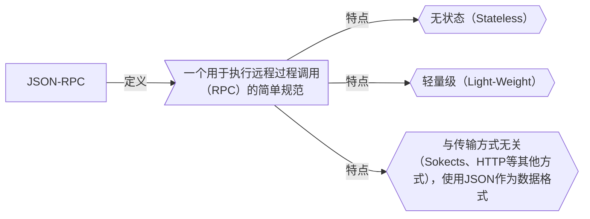
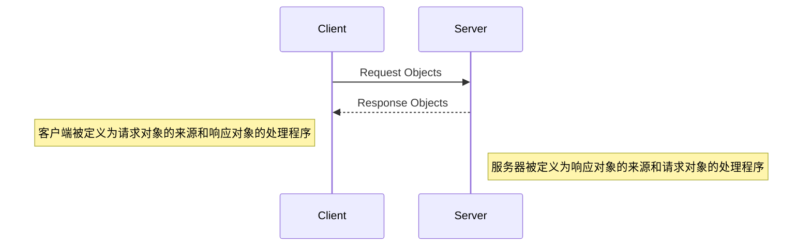
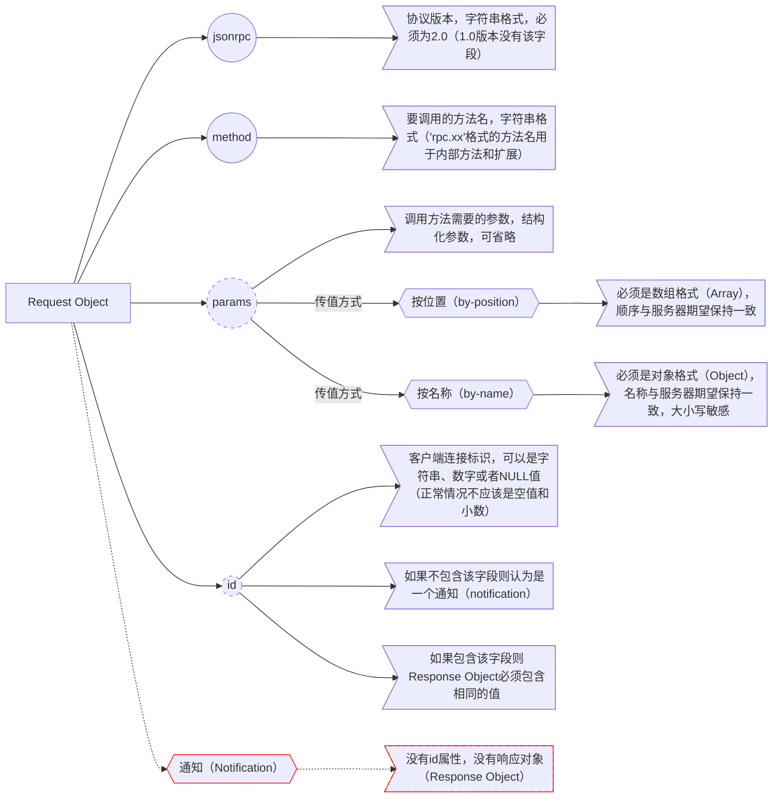

# JSON-RPC 2.0

```mermaid
flowchart LR
    A["JSON-RPC"]
    A-->|定义|A1>"一个用于执行远程过程调用（RPC）的简单规范"]
    A1-->|特点|A11{{"无状态（Stateless）"}}
    A1-->|特点|A12{{"轻量级（Light-Weight）"}}
    A1-->|特点|A13{{"与传输方式无关（Sokects、HTTP等其他方式），使用JSON作为数据格式"}}
```

```mermaid
sequenceDiagram
    Client ->> Server: Request Objects
    Server-->>Client: Response Objects
    Note left of Client: 客户端被定义为请求对象的来源和响应对象的处理程序
    Note right of Server: 服务器被定义为响应对象的来源和请求对象的处理程序

```

```mermaid
flowchart LR
    A["Request Object"]
    A-->A1(("jsonrpc"))-->A11>"协议版本，字符串格式，必须为2.0（1.0版本没有该字段）"]
    A-->A2(("method"))-->A21>"要调用的方法名，字符串格式（'rpc.xx'格式的方法名用于内部方法和扩展）"]
    A-->A3(("params"))-->A31>"调用方法需要的参数，结构化参数，可省略"]
    A3-->|传值方式|A32{{"按位置（by-position）"}}-->A321>"必须是数组格式（Array），顺序与服务器期望保持一致"]
    A3-->|传值方式|A33{{"按名称（by-name）"}}-->A331>"必须是对象格式（Object），名称与服务器期望保持一致，大小写敏感"]
    A-->A4(("id"))-->A41>"客户端连接标识，可以是字符串、数字或者NULL值（正常情况不应该是空值和小数）"]
    A4-->A42>"如果不包含该字段则认为是一个通知（notification）"]
    A4-->A43>"如果包含该字段则Response Object必须包含相同的值"]
    A-.->A5{{"通知（Notification）"}}
    A5-.->A51>"没有id属性，没有响应对象（Response Object）"]

    classDef optional stroke-dasharray: 5 5
    classDef optional_red stroke-dasharray: 5 5 color:red,stroke:red
    class A3,A4 optional
    class A5,A51 optional_red
```

