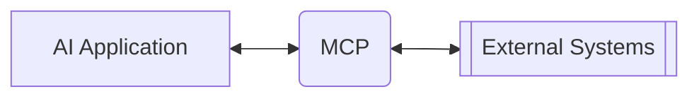
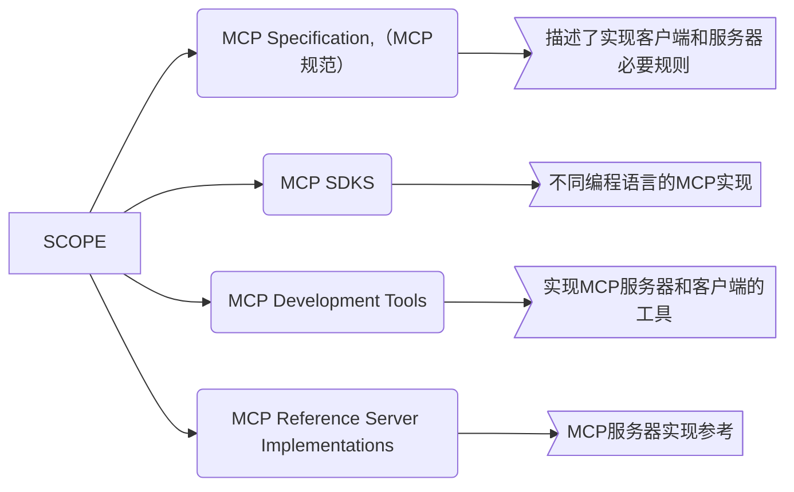
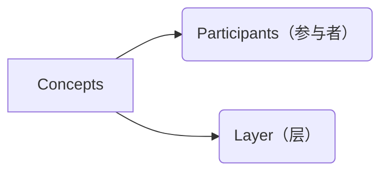
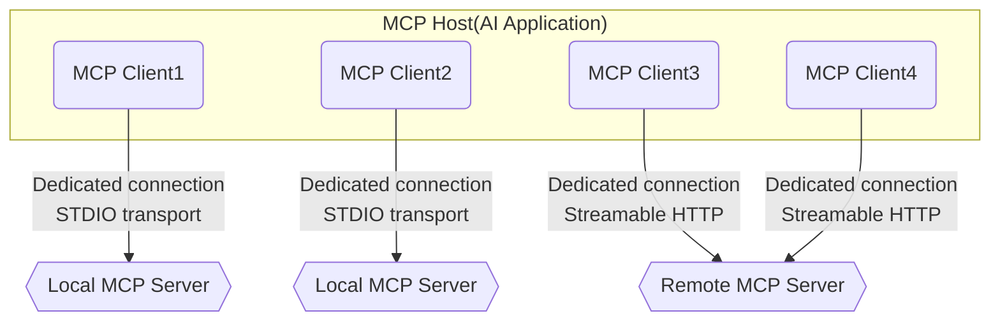
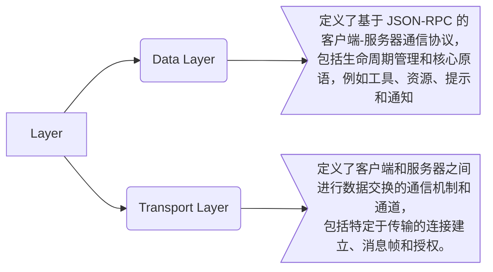
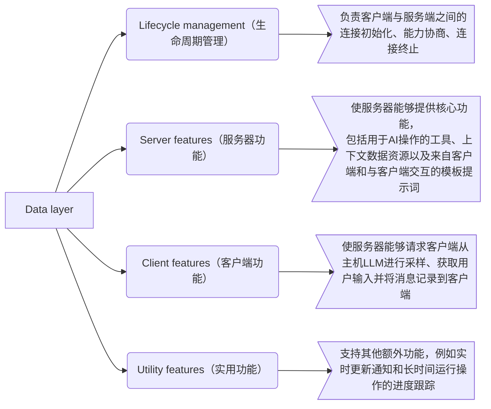
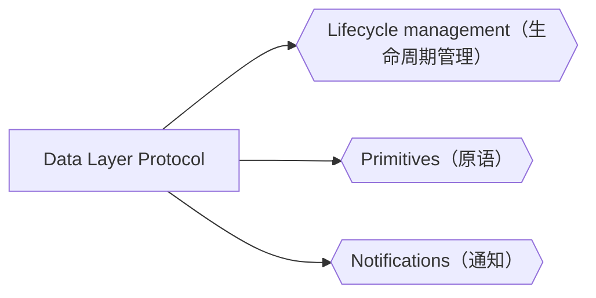
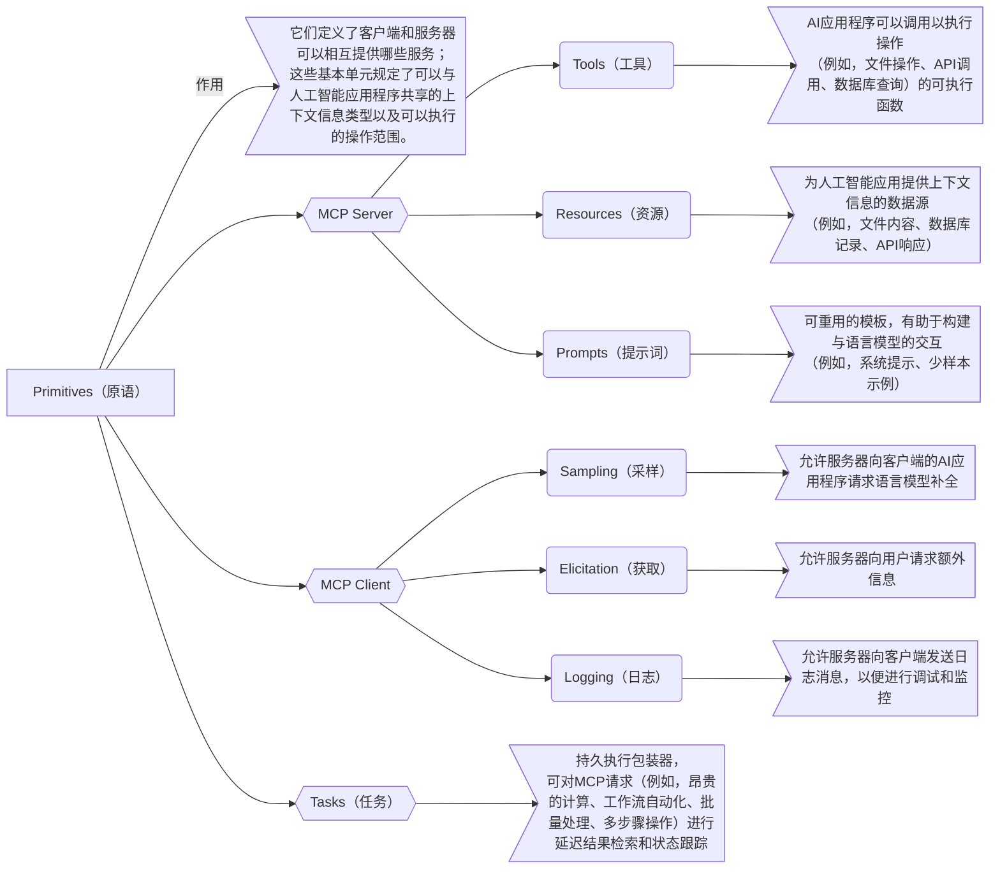
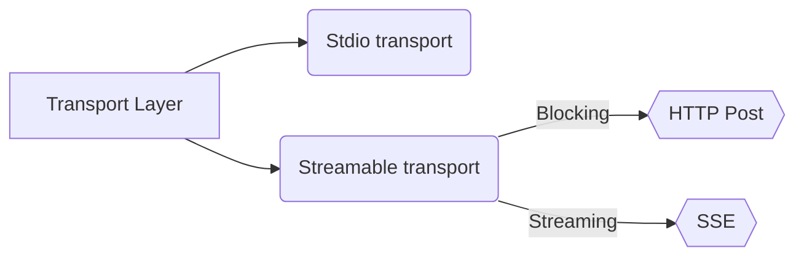

# MCP

---

> 全称：模型上下文协议（`Model Context Protocol`），一种有状态协议（Stateful Protocol）

> 作用：一种AI应用连接外部系统的开源标准

---

## Scope(范围)

## Concepts(概念)

### Participants(参与者)

- 三者的关系可以如下表示：

### Layer(层)

#### Data Layer(数据层)

#### Data Layer Protocol(数据层协议)

#### Transport Layer(传输层)

