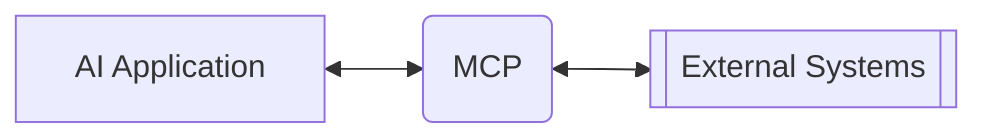
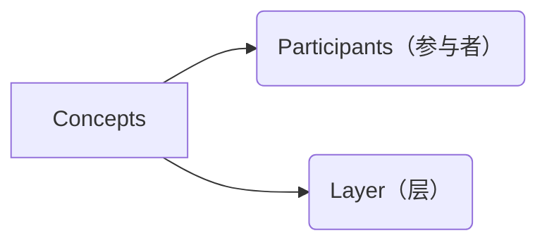
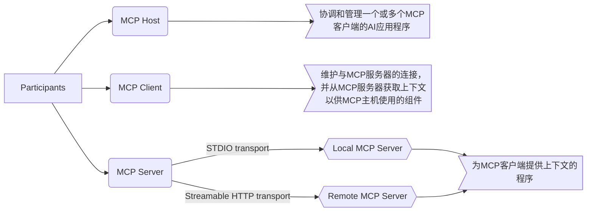
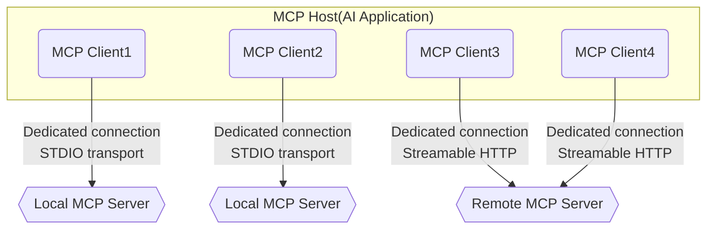

# MCP

---

> 全称：模型上下文协议（`Model Context Protocol`）

> 作用：一种AI应用连接外部系统的开源标准

---

```mermaid
flowchart LR

A["AI Application"]
B("MCP")
C[["External Systems"]]

A<-->B<-->C
```

## Scope(范围)

```mermaid
flowchart LR
A["SCOPE"]

A-->A1("MCP Specification,（MCP规范）")-->A11>"描述了实现客户端和服务器必要规则"]
A-->A2("MCP SDKS")-->A21>"不同编程语言的MCP实现"]
A-->A3("MCP Development Tools")-->A31>"实现MCP服务器和客户端的工具"]
A-->A4("MCP Reference Server Implementations")-->A41>"MCP服务器实现参考"]
```

## Concepts(概念)

```mermaid
flowchart LR
A["Concepts"]
A-->A1("Participants（参与者）")
A-->A2("Layer（层）")
```

### Participants(参与者)

```mermaid
flowchart LR

A["Participants"]
A-->A1("MCP Host")-->A11>"协调和管理一个或多个MCP客户端的AI应用程序"]
A-->A2("MCP Client")-->A21>"维护与MCP服务器的连接，
并从MCP服务器获取上下文以供MCP主机使用的组件"]
A-->A3("MCP Server")
A3-->|"STDIO transport"|A31{{"Local  MCP Server"}}
A3-->|"Streamable HTTP transport"|A32{{"Remote MCP Server"}}
A31-->A311>"为MCP客户端提供上下文的程序"]
A32-->A311
```

- 三者的关系可以如下表示：

```mermaid
flowchart TB
  subgraph A["MCP Host(AI Application)"]
   B1("MCP Client1")
   B2("MCP Client2")
   B3("MCP Client3")
   B4("MCP Client4")
  end
  C1{{"Local MCP Server"}}
  C2{{"Local MCP Server"}}
  C3{{"Remote MCP Server"}}
B1-->|"Dedicated connection
STDIO transport"|C1
B2-->|"Dedicated connection
STDIO transport
"|C2
B3-->|"Dedicated  connection
Streamable HTTP"|C3
B4-->|"Dedicated connection
Streamable HTTP"|C3
```

### Layer(层)

```mermaid
flowchart LR

A["Layer"]

A-->A1("Data Layer")-->A11>"定义了基于 JSON-RPC 的客户端-服务器通信协议，
包括生命周期管理和核心原语，例如工具、资源、提示和通知"]

A-->A2("Transport Layer")-->21>"定义了客户端和服务器之间进行数据交换的通信机制和通道，
包括特定于传输的连接建立、消息帧和授权。"]
```
