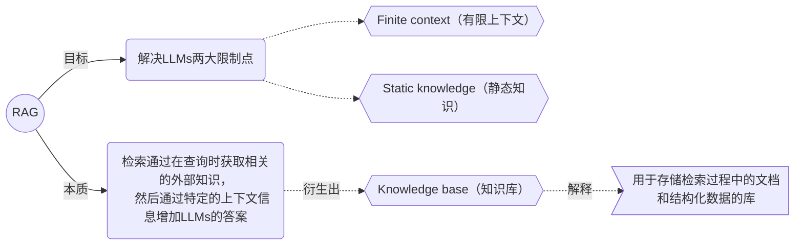
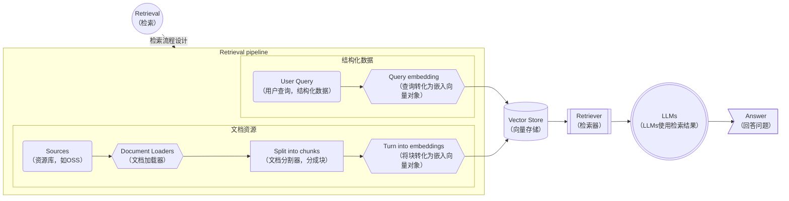
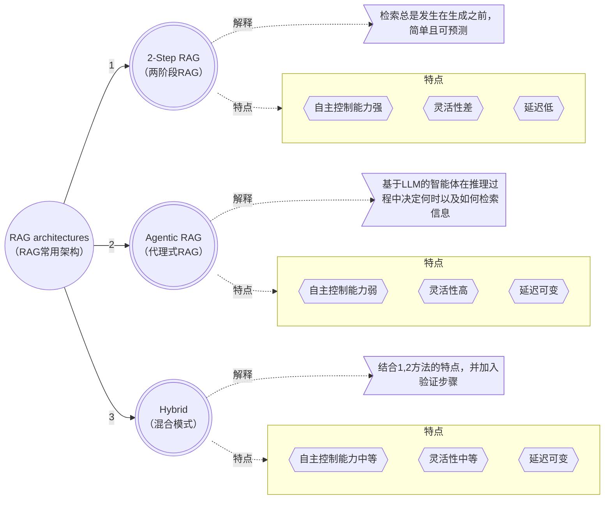

# Retrieval-Augmented Generation

```mermaid
flowchart LR
    A(("RAG"))
    
    A-->|目标|A1("解决LLMs两大限制点")
    A1-.->A11{{"Finite context（有限上下文）"}}
    A1-.->A12{{"Static knowledge（静态知识）"}}
    
    A-->|本质|A2("检索通过在查询时获取相关的外部知识，
    然后通过特定的上下文信息增加LLMs的答案")
    A2-.->|衍生出|A21{{"Knowledge base（知识库）"}}
    A21-.->|解释|A211>"用于存储检索过程中的文档和结构化数据的库"]
```

```mermaid
flowchart LR
    A(("Retrieval
    （检索）"))
    subgraph A1["Retrieval pipeline"]
        direction LR
        subgraph f1["文档资源"]
            direction LR
            A11("Sources
            （资源库，如OSS）")
            A11-->A12{{"Document Loaders
            （文档加载器）"}}
            A12-->A13["Split into chunks
            （文档分割器，分成块）"]
            A13-->A14{{"Turn into embeddings
            （将块转化为嵌入向量对象）"}}
        end
        subgraph f2["结构化数据"]
           direction LR
            A21("User Query
            （用户查询，结构化数据）")
            A21-->A22{{"Query embedding
            （查询转化为嵌入向量对象）"}}
        end
    end
        A22-->A15
        A14-->A15[("Vector Store
        （向量存储）")]
        A15-->A16[["Retriever
        （检索器）"]]
        A16-->A17((("LLMs
        （LLMs使用检索结果）")))
        A17-->A18>"Answer
        （回答问题）"]
 
    A-->|检索流程设计|A1
```

```mermaid
flowchart LR
    A(("RAG architectures
    （RAG常用架构）"))
    
    A-->|1|A1((("2-Step RAG
    （两阶段RAG）")))
    A1-.->|解释|A11>"检索总是发生在生成之前，简单且可预测"]
    subgraph A12["特点"]
        direction TB
        A121{{"自主控制能力强"}}
        A122{{"灵活性差"}}
        A123{{"延迟低"}}
    end
    A1-.->|特点|A12
    
    A-->|2|A2((("Agentic RAG
    （代理式RAG）")))
    A2-.->|解释|A21>"基于LLM的智能体在推理过程中决定何时以及如何检索信息"]
    subgraph A22["特点"]
        direction TB
        A221{{"自主控制能力弱"}}
        A222{{"灵活性高"}}
        A223{{"延迟可变"}}
    end
    A2-.->|特点|A22
    
    A-->|3|A3((("Hybrid
    （混合模式）")))
    A3-.->|解释|A31>"结合1,2方法的特点，并加入验证步骤"]
    subgraph A32["特点"]
        direction TB
        A321{{"自主控制能力中等"}}
        A322{{"灵活性中等"}}
        A323{{"延迟可变"}}
    end
    A3-.->|特点|A32
```