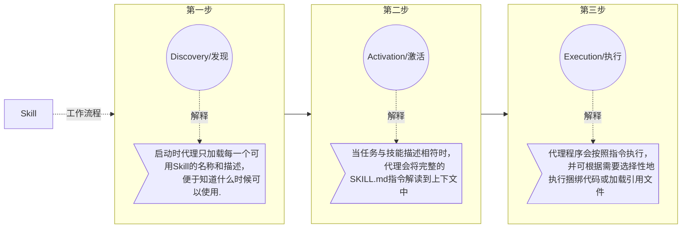
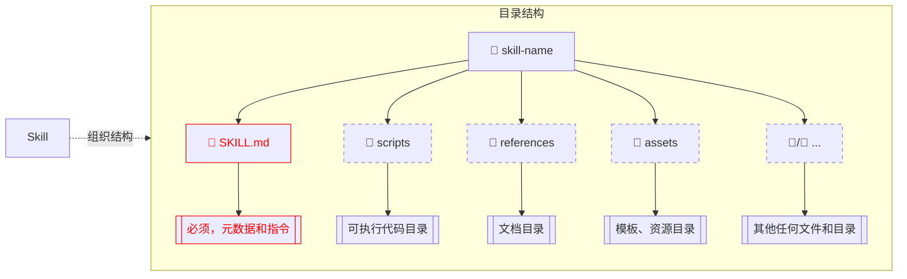
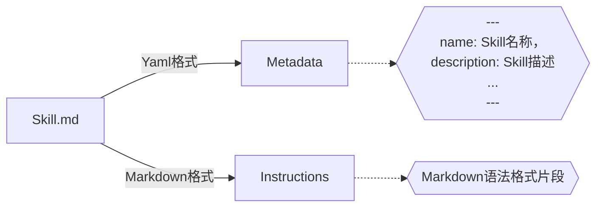
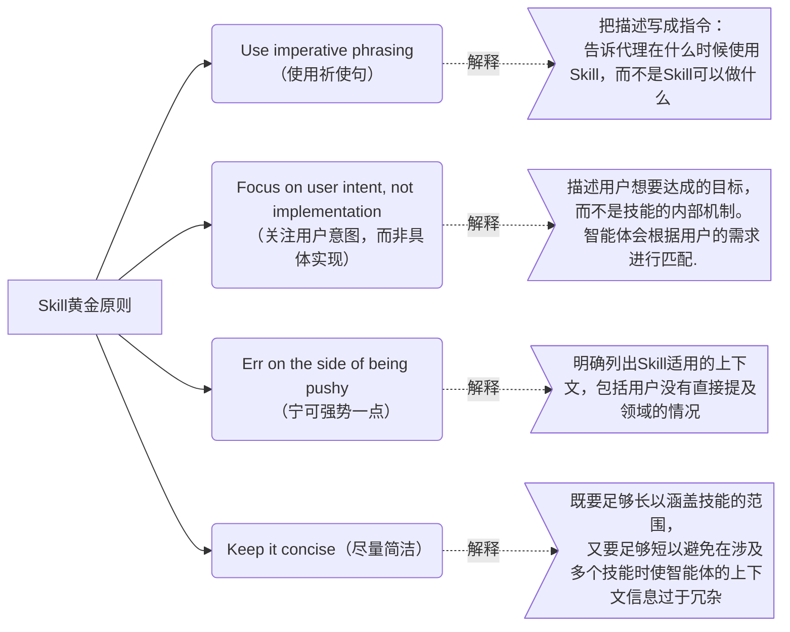
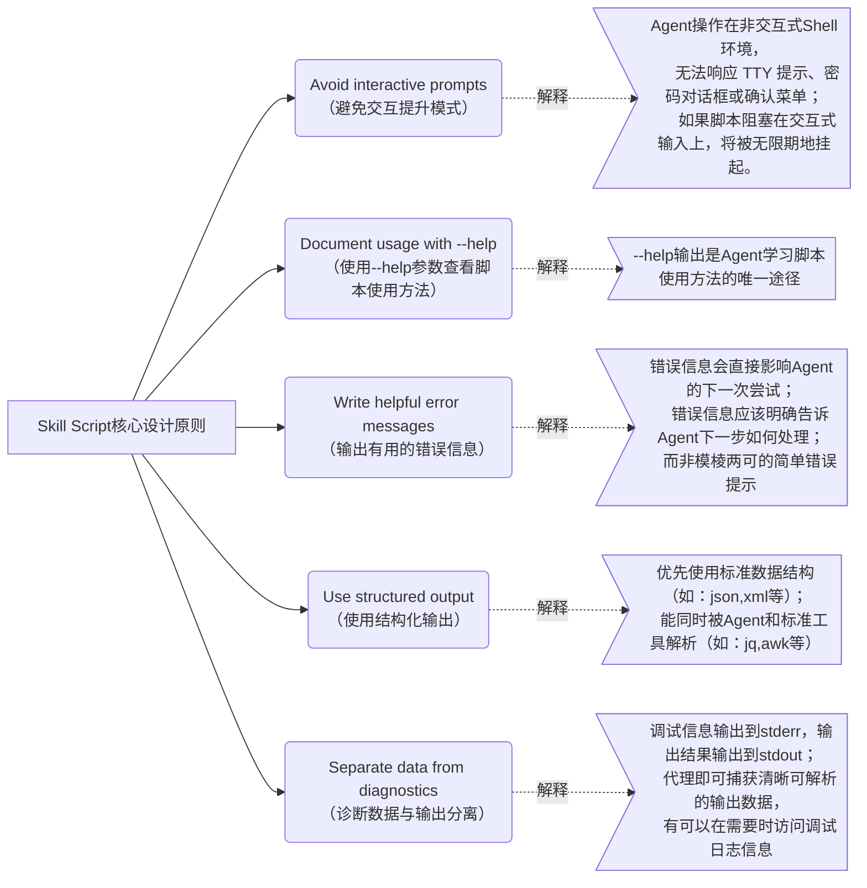
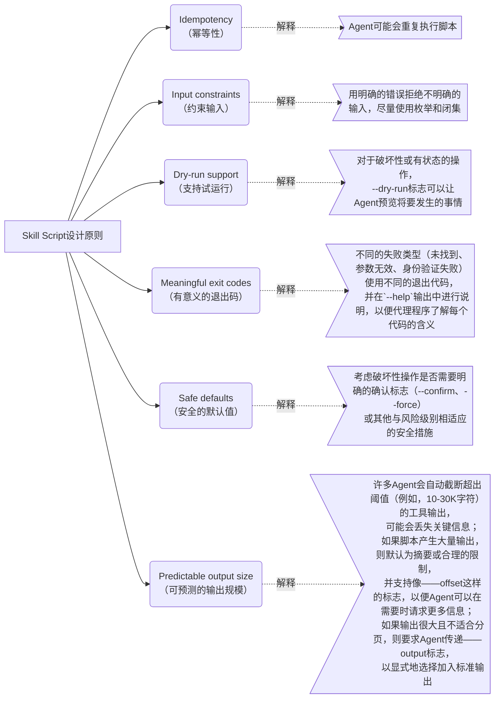

# Skill

## 什么是Skill？


## 为什么要使用Skill？


## Skill如何工作？



## Skill文件结构



## Skill.md


- Metadata属性列表

| 属性名           | 是否必填 | 描述                       | 要求                                                                                               |
|---------------|------|--------------------------|--------------------------------------------------------------------------------------------------|
| name          | √    | Skill名称                  | 最多64个字符； <br/>只能使用小写字母、数字、连字符(-)；<br/>不能使用连字符(-)开始和结尾；<br/>不能包含连续的连字符(--)；<br/>必须保持与Skill根目录名一致； |
| description   | √    | 描述信息                     | 最多1024个字符；<br/>应当描述Skill能做什么以及什么时候使用；<br/>应包含有助于代理识别相关任务的特定关键词;                                  |
| license       |      | 许可证                      |                                                                                                  |
| compatibility |      | 兼容性描述，如Skill依赖的运行环境，依赖包等 | 最多500字符；                                                                                         |
| metadata      |      | 可选的附加元数据                 | yaml格式的key:value键值对                                                                              |
| allowed-tools |      | 一系列以空格分隔的、预先批准运行的工具      | **试验阶段**                                                                                         |

```yaml
---
name: my-skill
description: 支持读取MySQL数据库表结构生成Mybatis相关文件。在基于Mybatis和MySQL开发Java项目时使用。
license: Apache License 2.0
compatibility: 需要MySQL8.0+、JDK21+、SpringBoot4.x、MyBatis3.x
metadata:
  author: yiduo
  email: yiduo@projdk.com
---
```

## Skill Description编写黄金原则



## Skill Script设计原则


