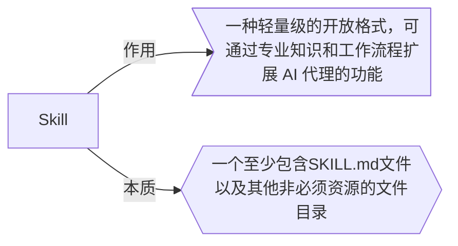
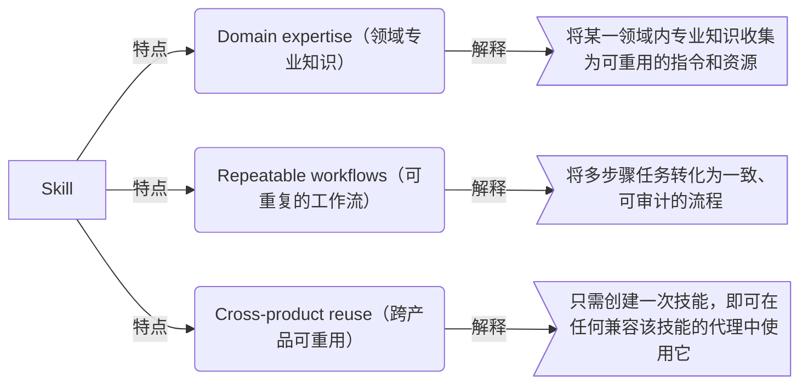
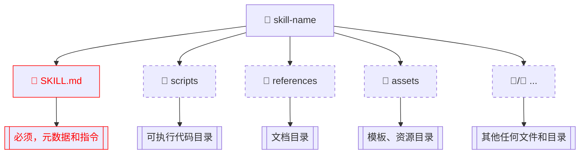

# Skill

```mermaid
flowchart LR
A["Skill"]

A-->|作用|A1>"一种轻量级的开放格式，可通过专业知识和工作流程扩展 AI 代理的功能"]

A-->|本质|A2{{"一个至少包含SKILL.md文件以及其他非必须资源的文件目录"}}
```

```mermaid
flowchart LR

A["Skill"]
A-->|特点|A1("Domain expertise（领域专业知识）")-->|解释|A11>"将某一领域内专业知识收集为可重用的指令和资源"]
A-->|特点|A2("Repeatable workflows（可重复的工作流）")-->|解释|A21>"将多步骤任务转化为一致、可审计的流程"]
A-->|特点|A3("Cross-product reuse（跨产品可重用）")-->|解释|A31>"只需创建一次技能，即可在任何兼容该技能的代理中使用它"]
```

```mermaid
flowchart LR
    s["Skill"] -.工作流程.-> one
    subgraph one["第一步"]
        direction TB
        A(("Discovery/发现"))-.->|解释|A1>"启动时代理只加载每一个可用Skill的名称和描述，
            便于知道什么时候可以使用."]

    end
    subgraph two["第二步"]
        direction TB
        B(("Activation/激活"))-.->|解释|B1>"当任务与技能描述相符时，
         代理会将完整的SKILL.md指令解读到上下文中"]

    end
    subgraph three["第三步"]
       direction TB
       C(("Execution/执行"))-.->|解释|C1>"代理程序会按照指令执行，
         并可根据需要选择性地执行捆绑代码或加载引用文件"] 
    end
one-->two-->three
```

```mermaid
flowchart TD
    root[📁 skill-name]
    root --> core[📄 SKILL.md]-->core_doc[["必须，元数据和指令"]]
    root --> scripts[📁 scripts]-->scripts_doc[["可执行代码目录"]]
    root --> references[📁 references]-->references_doc[["文档目录"]]
    root --> assets[📁 assets]-->assets_doc[["模板、资源目录"]]
    root --> other[📁/📄 ...]-->other_doc[["其他任何文件和目录"]]
classDef required color:red,stroke:red
classDef optional stroke-dasharray: 5 5
class core,core_doc required
class scripts,references,assets,other optional
```
```mermaid


```