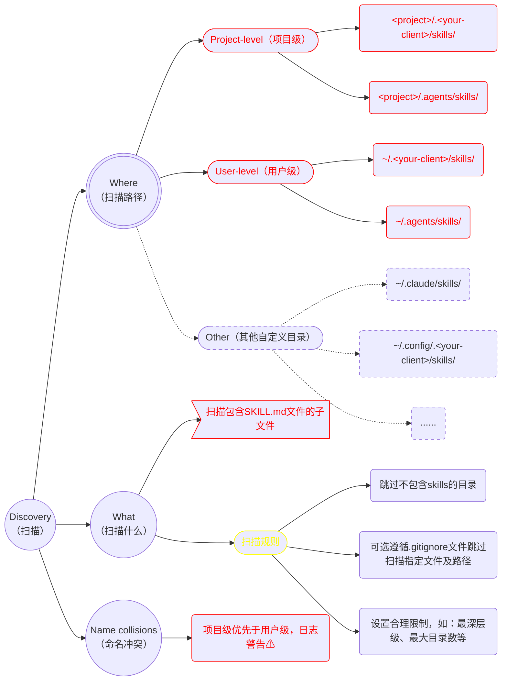
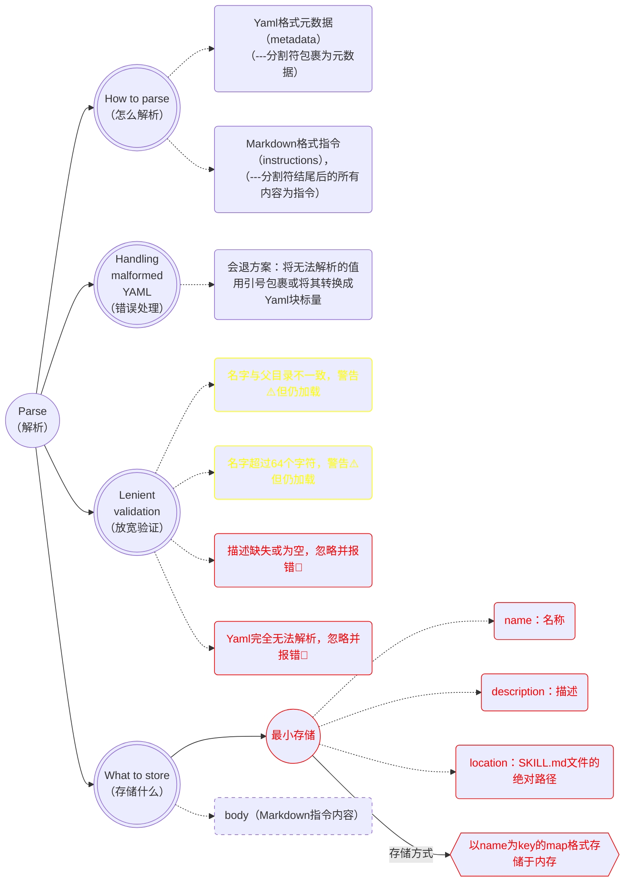
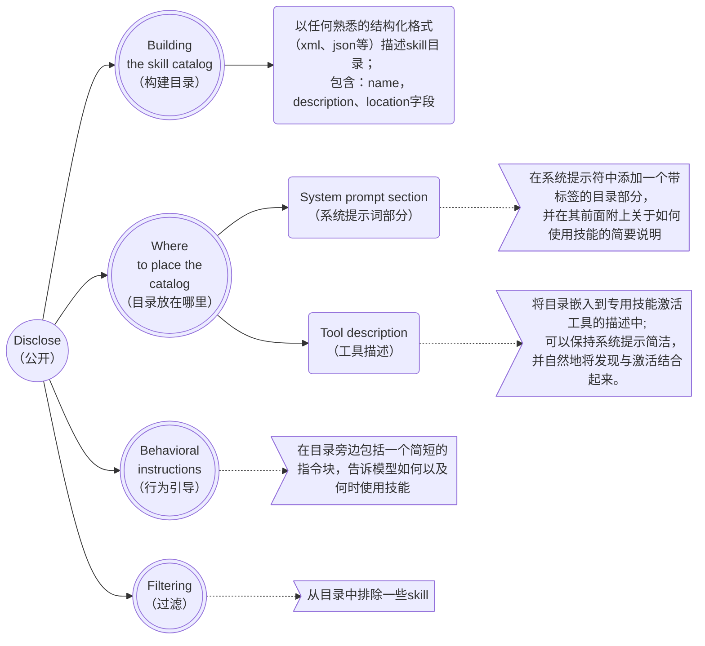

## 如何让自己的客户端支持Skill能力？

```mermaid
flowchart LR
    A(("Discovery
    （扫描）"))
    A-->A1((("Where
    （扫描路径）")))
    A1-->A11(["Project-level（项目级）"])
    A11-->A111("&lt;project>/.&lt;your-client>/skills/")
    A11-->A112("&lt;project>/.agents/skills/")
    A1-->A21(["User-level（用户级）"])
    A21-->A211("~/.&lt;your-client>/skills/")
    A21-->A212("~/.agents/skills/")
    A1-.->A31(["Other（其他自定义目录）"])
    A31-.->A311("~/.claude/skills/")
    A31-.->A312("~/.config/.&lt;your-client>/skills/")
    A31-.->A313("......")
    
    A-->B(("What
    （扫描什么）"))
    B-->B1>"扫描包含SKILL.md文件的子文件"]
    B-->B2(["扫描规则"])
    B2-->B21("跳过不包含skills的目录")
    B2-->B22("可选遵循.gitignore文件跳过扫描指定文件及路径")
    B2-->B23("设置合理限制，如：最深层级、最大目录数等")
 
    A-->C(("Name collisions
    （命名冲突）"))
    C-->C1("项目级优先于用户级，日志警告⚠")

classDef required color:red,stroke:red
classDef highlight color:yellow,stroke:yellow
classDef optional stroke-dasharray: 5 5
class A11,A21,A111,A112,A211,A212,B1,C1 required
class A31,A311,A312,A313 optional
class B2 highlight
```

```mermaid
flowchart LR
    A(("Parse
    （解析）"))
    A-->A1((("How to parse
    （怎么解析）")))
    A1-.->A11("Yaml格式元数据（metadata）
    （---分割符包裹为元数据）")
    A1-.->A12("Markdown格式指令（instructions），
    （---分割符结尾后的所有内容为指令）")
    
    A-->A2((("Handling 
    malformed 
    YAML 
    （错误处理）")))
    A2-.->A21("会退方案：将无法解析的值用引号包裹或将其转换成Yaml块标量")
    
    A-->A3((("
Lenient
validation
（放宽验证）")))
    A3-.->A31("名字与父目录不一致，警告⚠️但仍加载")
    A3-.->A32("名字超过64个字符，警告⚠️但仍加载")
    A3-.->A33("描述缺失或为空，忽略并报错🚫")
    A3-.->A34("Yaml完全无法解析，忽略并报错🚫")  

    A-->A4((("What to store
    （存储什么）")))
    A4-->A41(("最小存储"))
    A41-.->A411("name：名称")
    A41-.->A412("description：描述")
    A41-.->A413("location：SKILL.md文件的绝对路径")
    A41-->|存储方式|A414{{"以name为key的map格式存储于内存"}}
    A4-.->A42("body（Markdown指令内容）")

classDef required color:red,stroke:red
classDef warning color:yellow,stroke:yellow
classDef optional stroke-dasharray: 5 5
class A33,A34,A41,A411,A412,A413,A414 required
class A31,A32 warning
class A42 optional
```

```mermaid
flowchart LR
    A(("Disclose
    （公开）"))
    A-->A1((("Building
    the skill catalog
    （构建目录）")))
    A1-->A11("以任何熟悉的结构化格式（xml、json等）描述skill目录；
    包含：name，description、location字段")
    
    A-->A2((("Where 
    to place the 
    catalog
    （目录放在哪里）")))
    A2-->A21("System prompt section
    （系统提示词部分）")
    A21-.->A211>"在系统提示符中添加一个带标签的目录部分，
    并在其前面附上关于如何使用技能的简要说明"]
    A2-->A22("Tool description
    （工具描述）")
    A22-.->A221>"将目录嵌入到专用技能激活工具的描述中;
    可以保持系统提示简洁，并自然地将发现与激活结合起来。"]
    
    A-->A3((("Behavioral
    instructions
    （行为引导）")))
    A3-.->A31>"在目录旁边包括一个简短的指令块，告诉模型如何以及何时使用技能"]
    
    A-->A4((("Filtering
    （过滤）")))
    A4-.->A41>"从目录中排除一些skill"]
```