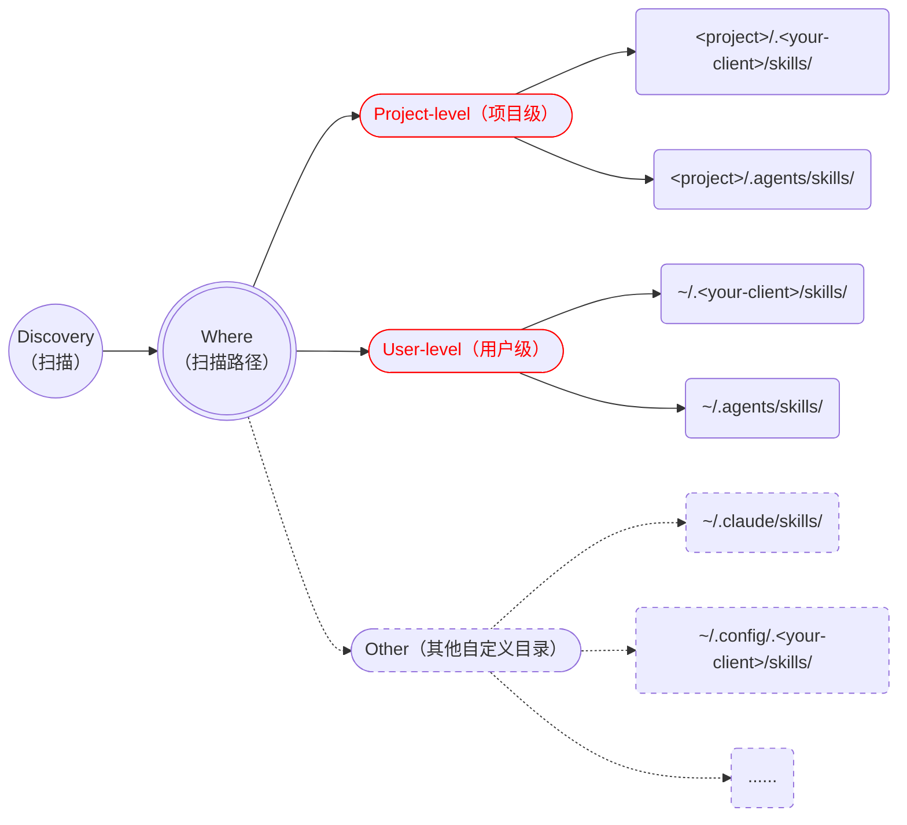

## 如何让自己的客户端支持Skill能力？

```mermaid
flowchart LR
    A(("Discovery
    （扫描）"))
    A-->A1((("Where
    （扫描路径）")))
    A1-->A11(["Project-level（项目级）"])
    A11-->A111("&lt;project>/.&lt;your-client>/skills/")
    A11-->A112("&lt;project>/.agents/skills/")
    A1-->A21(["User-level（用户级）"])
    A21-->A211("~/.&lt;your-client>/skills/")
    A21-->A212("~/.agents/skills/")
    A1-.->A31(["Other（其他自定义目录）"])
    A31-.->A311("~/.claude/skills/")
    A31-.->A312("~/.config/.&lt;your-client>/skills/")
    A31-.->A313("......")

classDef required color:red,stroke:red
classDef optional stroke-dasharray: 5 5
class A11,A21 required
class A31,A311,A312,A313 optional
```