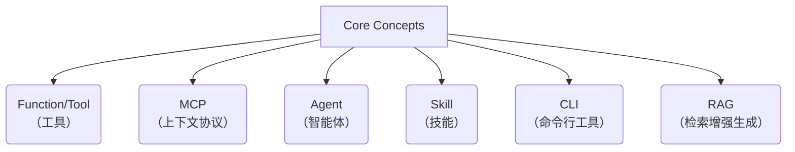

# 核心概念

```mermaid
flowchart TB

A["Core Concepts"]
A1("Function/Tool
（工具）")
A2("MCP
（上下文协议）")
A3("Agent
（智能体）")
A4("Skill
（技能）")
A5("CLI
（命令行工具）")
A6("RAG
（检索增强生成）")
A-->A1
A-->A2
A-->A3
A-->A4
A-->A5
A-->A6
```
