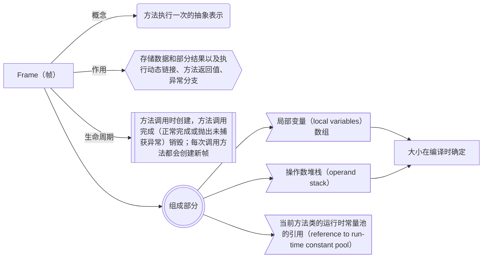
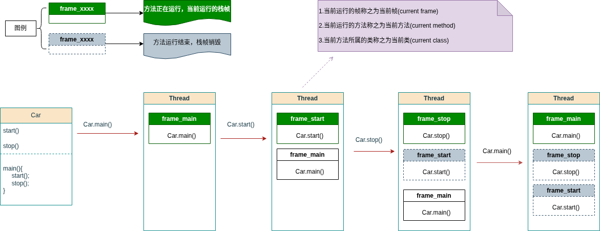

# Frame

> JVM栈帧

```mermaid
flowchart LR
    A["Frame（帧）"]
    A-->|概念|A1("方法执行一次的抽象表示")
    A-->|作用|A2{{"存储数据和部分结果以及执行动态链接、方法返回值、异常分支"}}
    A-->|生命周期|A3[["方法调用时创建，方法调用完成（正常完成或抛出未捕获异常）销毁"；每次调用方法都会创建新帧]]
    A-->A4((("组成部分")))
    A4-->A41>"局部变量（local variables）数组"]
    A4-->A42>"操作数堆栈（operand stack）"]
    A4-->A43>"当前方法类的运行时常量池的引用（reference to run-time constant pool）"]
    A400["大小在编译时确定"]
    A41-->A400
    A42-->A400
```

