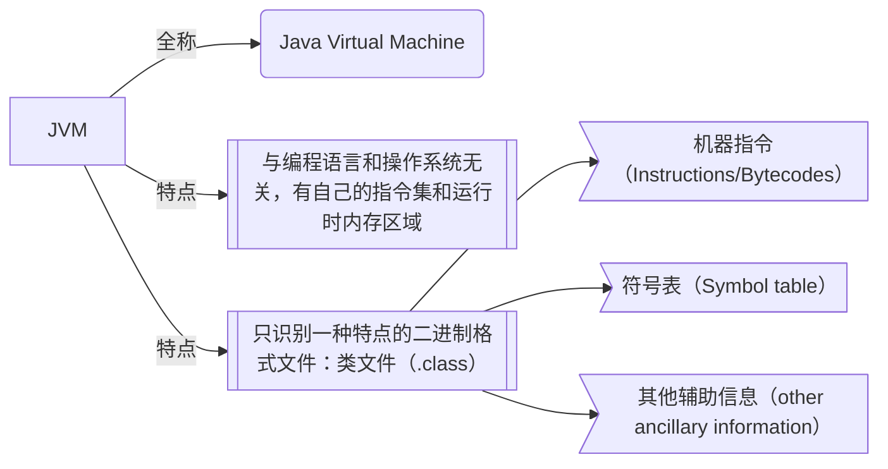
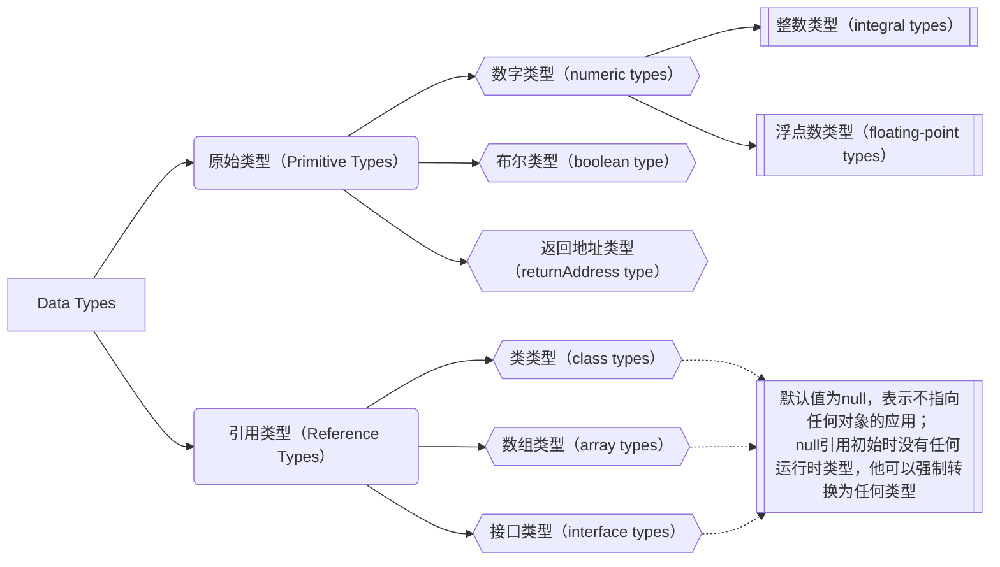
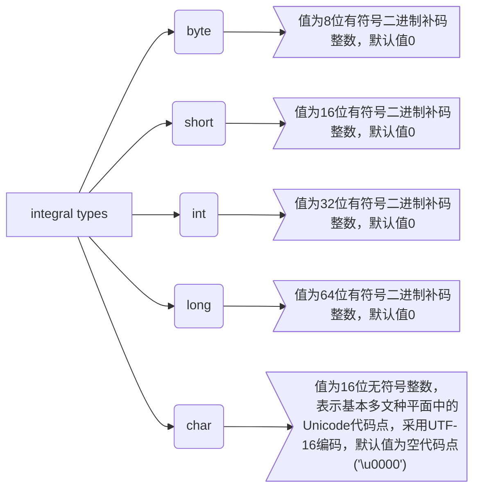
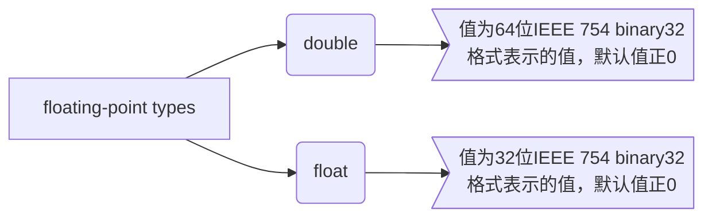
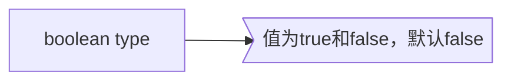
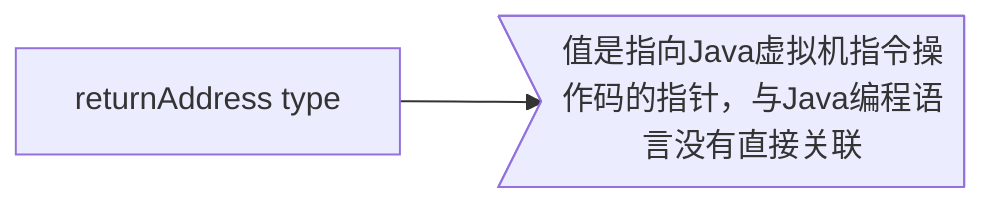

# JVM

```mermaid
flowchart LR
    A["JVM"]
    A-->|全称|A1("Java Virtual Machine")
    A-->|特点|A2[["与编程语言和操作系统无关，有自己的指令集和运行时内存区域"]]
    A-->|特点|A3[["只识别一种特点的二进制格式文件：类文件（.class）"]]
    A3-->A31>"机器指令（Instructions/Bytecodes）"]
    A3-->A32>"符号表（Symbol table）"]
    A3-->A33>"其他辅助信息（other ancillary information）"]
```

```mermaid
flowchart LR
    A["Data Types"]
    A-->A1("原始类型（Primitive Types）")
    A-->A2("引用类型（Reference Types）")
    A1-->A11{{"数字类型（numeric types）"}}
    A1-->A12{{"布尔类型（boolean type）"}}
    A1-->A13{{"返回地址类型（returnAddress type）"}}
    
    A11-->A111[["整数类型（integral types）"]]
    A11-->A112[["浮点数类型（floating-point types）"]]
    
    A2-->A21{{"类类型（class types）"}}
    A2-->A22{{"数组类型（array types）"}}
    A2-->A23{{"接口类型（interface types）"}}
    
    A21-.->A210[["默认值为null，表示不指向任何对象的应用；
    null引用初始时没有任何运行时类型，他可以强制转换为任何类型"]]
    A22-.->A210
    A23-.->A210
```

```mermaid
flowchart LR
    A["integral types"]
    A-->A1("byte")-->A11>"值为8位有符号二进制补码整数，默认值0"]
    A-->A2("short")-->A21>"值为16位有符号二进制补码整数，默认值0"]
    A-->A3("int")-->A31>"值为32位有符号二进制补码整数，默认值0"]
    A-->A4("long")-->A41>"值为64位有符号二进制补码整数，默认值0"]
    A-->A5("char")-->A51>"值为16位无符号整数，
    表示基本多文种平面中的Unicode代码点，采用UTF-16编码，默认值为空代码点('\u0000')"]

```

```mermaid
flowchart LR
    A["floating-point types"]
    A-->A1("double")-->A11>"值为64位IEEE 754 binary32格式表示的值，默认值正0"]
    A-->A2("float")-->A21>"值为32位IEEE 754 binary32格式表示的值，默认值正0"]
```

```mermaid
flowchart LR
    A["boolean type"]
    A-->A1>"值为true和false，默认false"]
```

```mermaid
flowchart LR
    A["returnAddress type"]
    A-->A1>"值是指向Java虚拟机指令操作码的指针，与Java编程语言没有直接关联"]
```