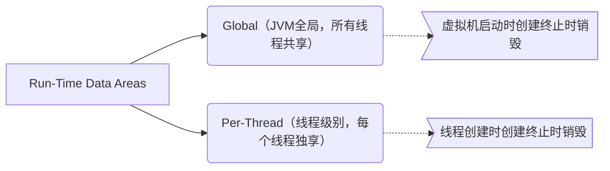
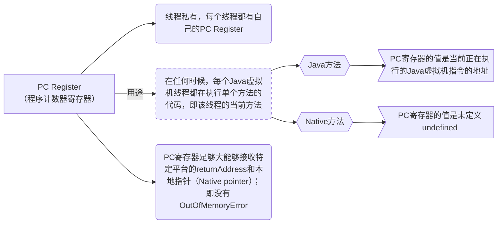
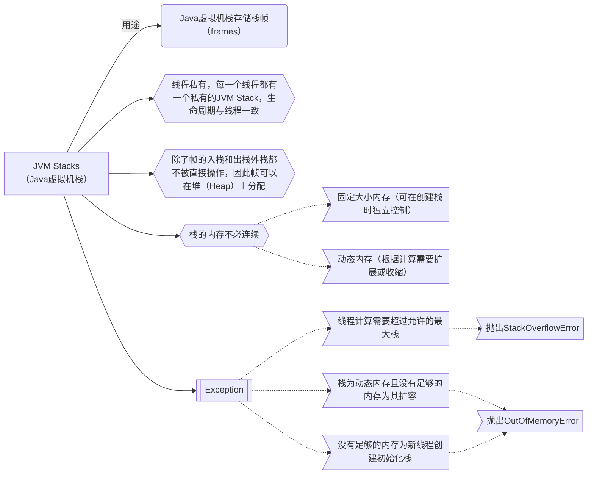
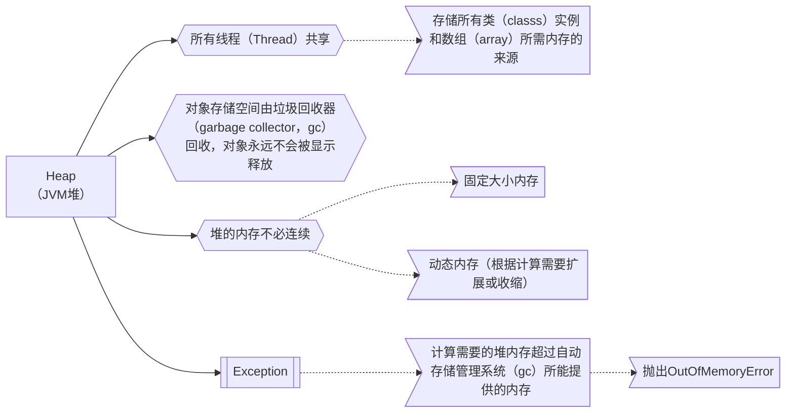

# Run-Time Data Areas

> 运行时数据区域

```mermaid
flowchart LR
    A["Run-Time Data Areas"]
    A-->A1("Global（JVM全局，所有线程共享）")
    A1-.->A11>"虚拟机启动时创建终止时销毁"]
    A-->A2("Per-Thread（线程级别，每个线程独享）")
    A2-.->A21>"线程创建时创建终止时销毁"]
```

```mermaid
flowchart LR
    A["PC Register
    （程序计数器寄存器）"]
    A-->A1("线程私有，每个线程都有自己的PC Register")
    A-->|用途|A2("在任何时候，每个Java虚拟机线程都在执行单个方法的代码，即该线程的当前方法")
    A2-->A21{{"Java方法"}}
    A21-->A211>"PC寄存器的值是当前正在执行的Java虚拟机指令的地址"]
    A2-->A22{{"Native方法"}}
    A22-->A221>"PC寄存器的值是未定义undefined"]
    A-->A3("PC寄存器足够大能够接收特定平台的returnAddress和本地指针（Native pointer）；
    即没有OutOfMemoryError")

classDef optional stroke-dasharray: 5 5
class A2 optional
```

```mermaid
flowchart LR
    A["JVM Stacks
    （Java虚拟机栈）"]
    A-->|用途|A1("Java虚拟机栈存储栈帧（frames）")
    A-->A2{{"线程私有，每一个线程都有一个私有的JVM Stack，生命周期与线程一致"}}
    A-->A3{{"除了帧的入栈和出栈外栈都不被直接操作，因此帧可以在堆（Heap）上分配"}}
    A-->A4{{"栈的内存不必连续"}}
    A4-.->A41>"固定大小内存（可在创建栈时独立控制）"]
    A4-.->A42>"动态内存（根据计算需要扩展或收缩）"]
    A-->A5[["Exception"]]
    A5-.->A51>"线程计算需要超过允许的最大栈"]
    A51-.->A511>"抛出StackOverflowError"]
    A5-.->A52>"栈为动态内存且没有足够的内存为其扩容"]
    A5-.->A53>"没有足够的内存为新线程创建初始化栈"]
    A52-.->A521>"抛出OutOfMemoryError"]
    A53-.->A521
```

```mermaid
flowchart LR
    A["Heap
    （JVM堆）"]
    A-->A1{{"所有线程（Thread）共享"}}
    A1-.->A11>"存储所有类（classs）实例和数组（array）所需内存的来源"]
    A-->A2{{"对象存储空间由垃圾回收器（garbage collector，gc）回收，对象永远不会被显示释放"}}
    A-->A3{{"堆的内存不必连续"}}
    A3-.->A31>"固定大小内存"]
    A3-.->A32>"动态内存（根据计算需要扩展或收缩）"]
    A-->A4[["Exception"]]
    A4-.->A41>"计算需要的堆内存超过自动存储管理系统（gc）所能提供的内存"]
    A41-.->A411>"抛出OutOfMemoryError"]
```