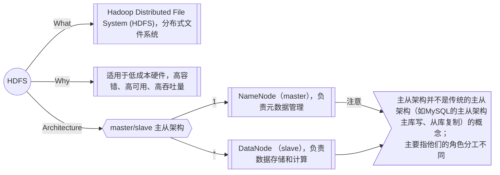
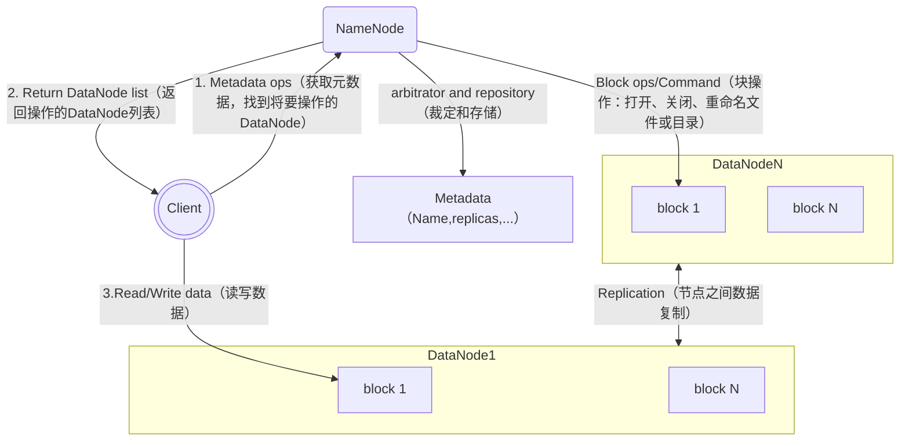
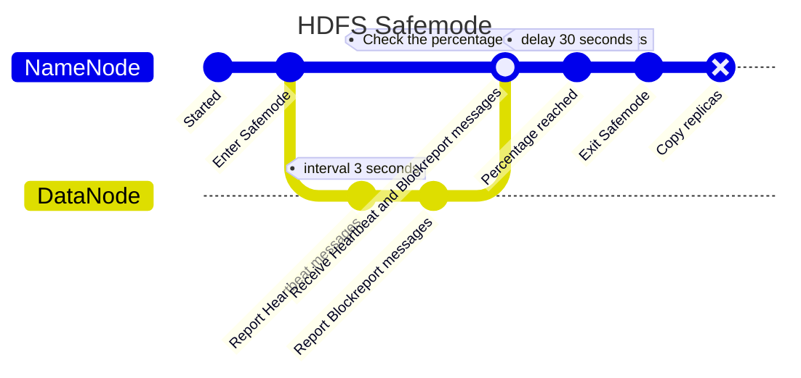
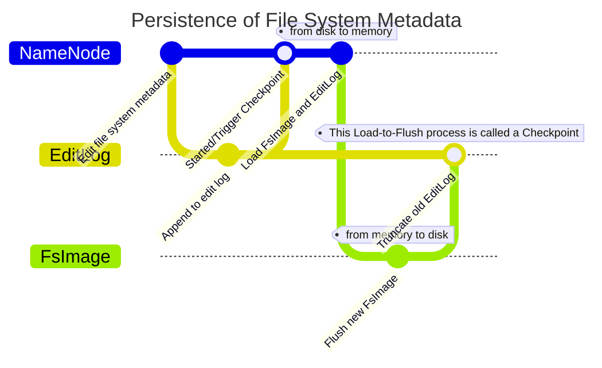

```mermaid

graph LR
    A((HDFS)) -->|What| B[["Hadoop Distributed File System (HDFS)，分布式文件系统"]]
    A --> |Why|C[["适用于低成本硬件，高容错、高可用、高吞吐量"]]
    A-->|Architecture|D{{"master/slave 主从架构"}}
    D-->|1|D1[["NameNode（master），负责元数据管理"]]
    D-->|*|D2[["DataNode （slave），负责数据存储和计算"]]
    D1-->|注意|D3>"主从架构并不是传统的主从架构（如MySQL的主从架构主库写、从库复制）的概念；
    主要指他们的角色分工不同"]
    D2-->D3

```

```mermaid
graph TB
    A("NameNode")
    A-->|"arbitrator and repository（裁定和存储）"|A1["Metadata（Name,replicas,...）"]
    subgraph "DataNodeN"
        direction RL
        B11["block 1"]
        B12["block N"]
    end
    subgraph "DataNode1"
        direction RL
        B21["block 1"]
        B22["block N"]
    end
    C@{ shape: dbl-circ, label: "Client" }
    A -->|Block ops/Command（块操作：打开、关闭、重命名文件或目录）| B11
    DataNodeN <-->|Replication（节点之间数据复制）| DataNode1
    C-->|1. Metadata ops（获取元数据，找到将要操作的DataNode）|A
    A-->|2. Return DataNode list（返回操作的DataNode列表）|C
    C-->|3.Read/Write data（读写数据）|B21
    
```

```mermaid
---
title: HDFS Safemode
config:
  logLevel: 'debug'
  //theme: 'default'
  gitGraph:
    showBranches: true
    showCommitLabel: true
    mainBranchName: 'NameNode'
    rotateCommitLabel: true
---
gitGraph
    commit id:"Started"
    commit id:"Enter Safemode"
    branch DataNode
    commit id:"Report Heartbeat messages" tag:"interval 3 seconds"
    commit id:"Report Blockreport messages"
    checkout NameNode
    merge DataNode id:"Receive Heartbeat and Blockreport messages" tag:"Check the percentage of safety block reports"
    commit id:"Percentage reached" tag: "delay 30 seconds"
    commit id:"Exit Safemode"
    commit type:REVERSE id:"Copy replicas"

```

```mermaid
---
title: Persistence of File System Metadata
config:
  logLevel: 'debug'
  //theme: 'default'
  gitGraph:
    showBranches: true
    showCommitLabel: true
    mainBranchName: 'NameNode'
    rotateCommitLabel: true
---
gitGraph
    commit id: "Edit file system metadata"
    branch EditLog
    commit id:"Append to edit log"
    checkout NameNode
    merge EditLog id:"Started/Trigger Checkpoint"
    commit id:"Load FsImage and EditLog" tag:"from disk to memory"
    branch FsImage
    commit id:"Flush new FsImage" tag:"from memory to disk"
    checkout EditLog
    merge FsImage id:"Truncate old EditLog" tag: "This Load-to-Flush process is called a Checkpoint"

```