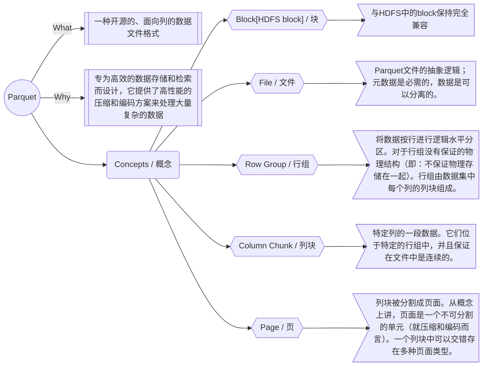

```mermaid
graph LR
    A((Parquet))
    A -->|What| B[["一种开源的、面向列的数据文件格式"]]
    A -->|Why| C[["专为高效的数据存储和检索而设计，它提供了高性能的压缩和编码方案来处理大量复杂的数据"]]
A-->D("Concepts / 概念")
D-->D1{{"Block[HDFS block] / 块"}}-->D11>"与HDFS中的block保持完全兼容"]
D-->D2{{"File / 文件"}}-->D21>"Parquet文件的抽象逻辑；元数据是必需的，数据是可以分离的。"]
D-->D3{{"Row Group / 行组"}}-->D31>"将数据按行进行逻辑水平分区。对于行组没有保证的物理结构（即：不保证物理存储在一起）。行组由数据集中每个列的列块组成。"]
D-->D4{{"Column Chunk / 列块"}}-->D41>"特定列的一段数据。它们位于特定的行组中，并且保证在文件中是连续的。"]
D-->D5{{"Page / 页"}}-->D51>"列块被分割成页面。从概念上讲，页面是一个不可分割的单元（就压缩和编码而言）。一个列块中可以交错存在多种页面类型。"]
```
> 文件层级结构：[parquet-hierarchically.md](parquet-hierarchically.md)
