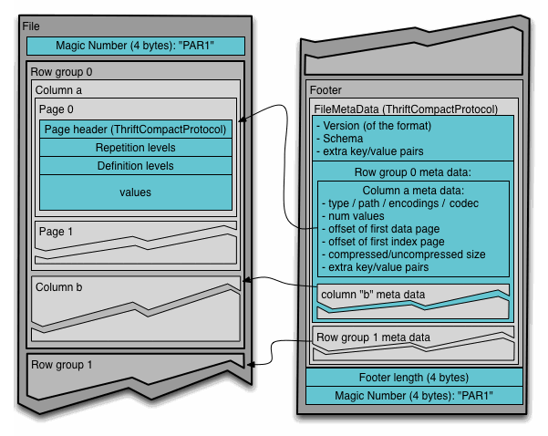

```mermaid
treeView-beta
├── Parquet File  // Parquet文件
│   ├── Row Group 1  // 行组1
│   │   ├── Column Chunk: id  // 列块: id
│   │   │   ├── Page 1  // 页1
│   │   │   ├── ......
│   │   │   └── Page N  // 页N
│   │   ├── Column Chunk: name  // 列块: name
│   │   │   ├── Page 1  // 页1
│   │   │   ├── ......
│   │   │   └── Page N  // 页N
│   ├── Row Group ...  // 行组...
│   ├── Row Group N  // 行组N
│   │   ├── Column Chunk: id  // 列块: id
│   │   │   ├── Page 1  // 页1
│   │   │   ├── ......
│   │   │   └── Page N  // 页N
│   │   ├── Column Chunk: name  // 列块: name
│   │   │   ├── Page 1  // 页1
│   │   │   ├── ......
│   │   │   └── Page N  // 页N
|   └── [Footer] (元数据区)
|   |   ├── Schema (表结构)
|   |   ├── Row Group 1 的 offset、大小
|   |   ├── Column Chunk 的 offset、统计信息 (min/max/null)
|   |   └── Row Group N 的信息...

```