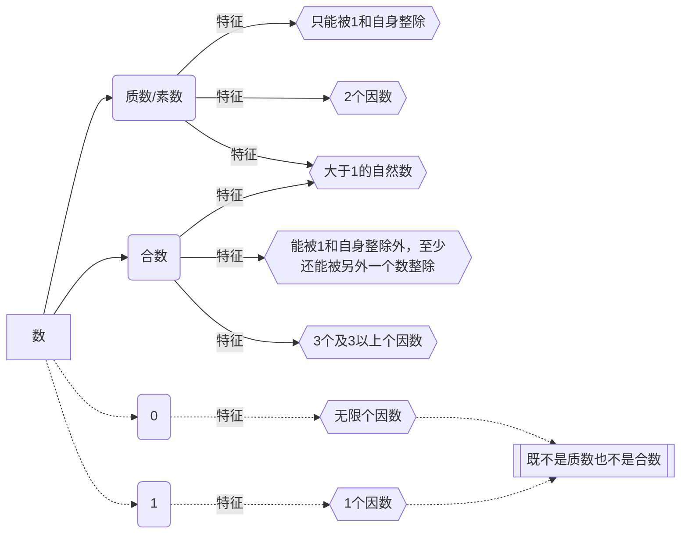

# 数学—质数和合数

```mermaid
flowchart LR

A["数"]

A-->A1("质数/素数") 
A1-->|特征|A11{{"只能被1和自身整除"}}
A1-->|特征|A13{{"2个因数"}}
A1-->|特征|A12{{"大于1的自然数"}}


A-->A2("合数")
A2-->|特征|A12
A2-->|特征|A21{{"能被1和自身整除外，至少还能被另外一个数整除"}}
A2-->|特征|A23{{"3个及3以上个因数"}}

A-.->A3("0")
A3-.->|特征|A31{{"无限个因数"}}

A-.->A4("1")
A4-.->|特征|A41{{"1个因数"}}

A31-.->A311[["既不是质数也不是合数"]]
A41-.->A311
```
