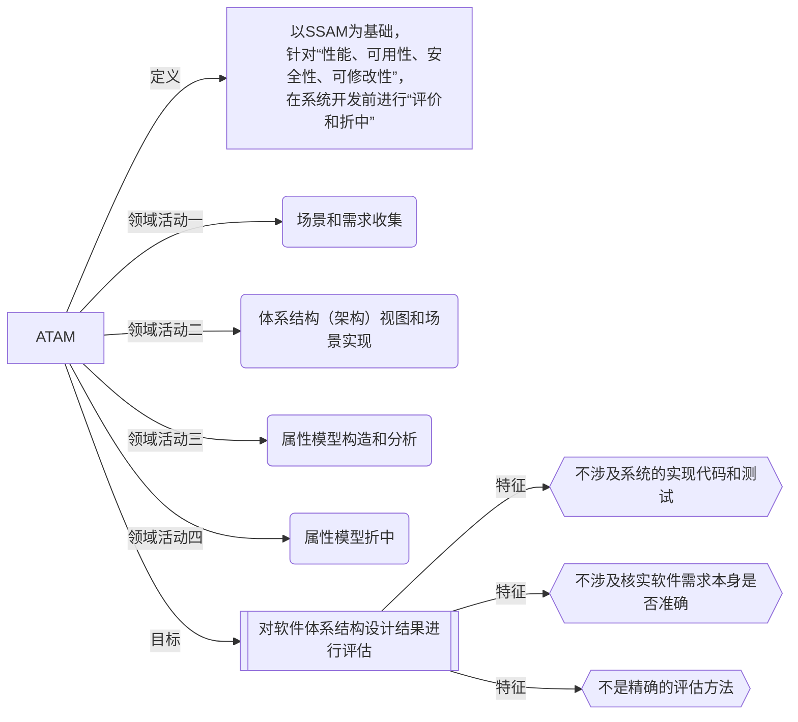
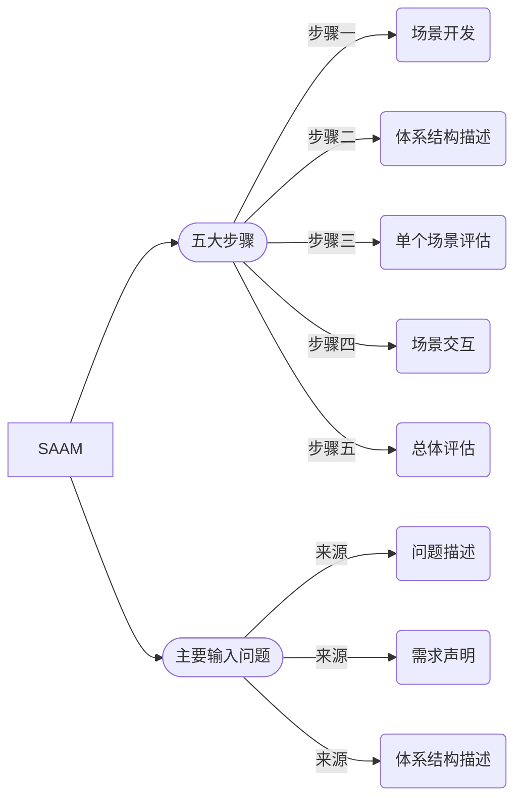

# ATAM&&SAAM

## ATAM体系结构权衡分析方法

> ATAM：Architecture Tradeoff Analysis Method

```mermaid
flowchart LR
A["ATAM"]
A-->|定义|B["以SSAM为基础，
       针对“性能、可用性、安全性、可修改性”，
       在系统开发前进行“评价和折中”"]
A-->|领域活动一|C("场景和需求收集")
A-->|领域活动二|D("体系结构（架构）视图和场景实现")
A-->|领域活动三|E("属性模型构造和分析")
A-->|领域活动四|F("属性模型折中")
A-->|目标|A1[["对软件体系结构设计结果进行评估"]]
A1-->|特征|A11{{"不涉及系统的实现代码和测试"}}
A1-->|特征|A12{{"不涉及核实软件需求本身是否准确"}}
A1-->|特征|A13{{"不是精确的评估方法"}}
```

## SAAM基于场景架构分析法

> SAAM：Scenarios-based Architecture Analysis Method

```mermaid
flowchart LR
A["SAAM"]
A-->A1(["五大步骤"])
A1-->|步骤一|A11("场景开发")
A1-->|步骤二|A12("体系结构描述")
A1-->|步骤三|A13("单个场景评估")
A1-->|步骤四|A14("场景交互")
A1-->|步骤五|A15("总体评估")
A-->A2(["主要输入问题"])
A2-->|来源|A21("问题描述")
A2-->|来源|A22("需求声明")
A2-->|来源|A23("体系结构描述")
```
