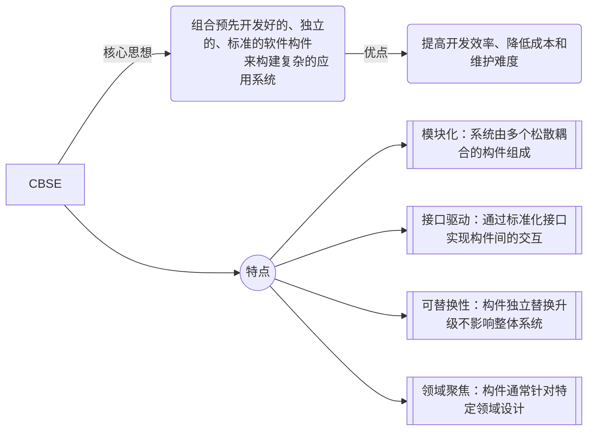
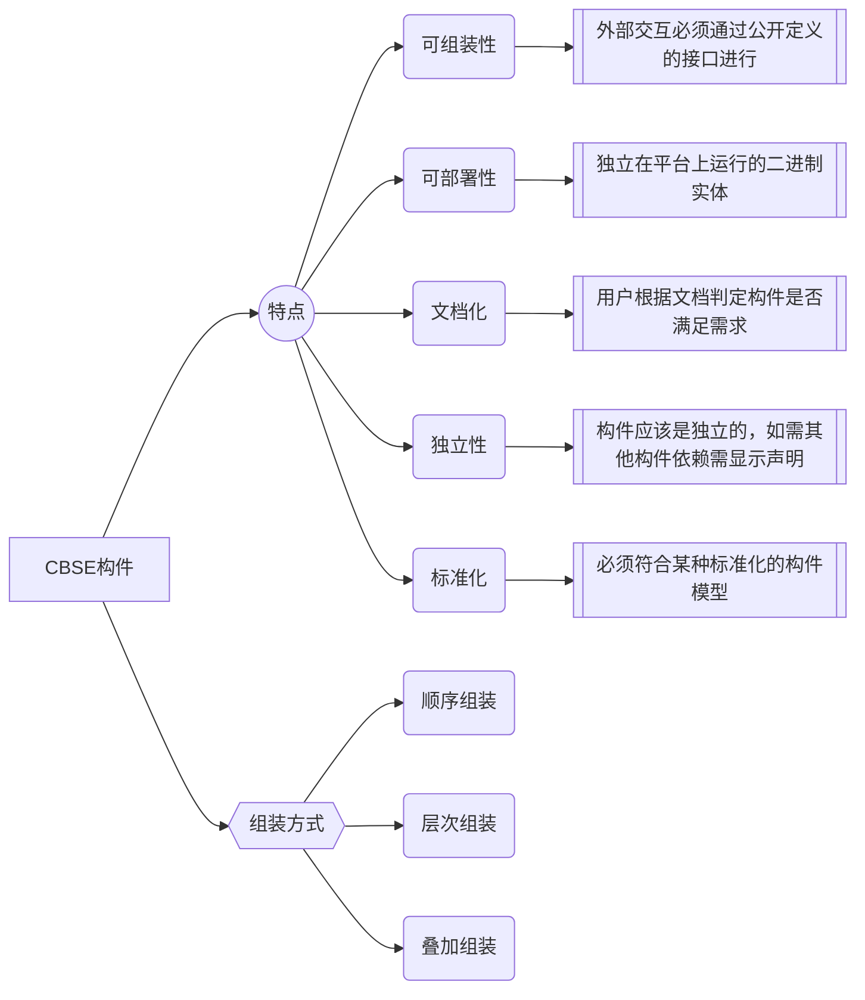

# CBSE基于构件的软件工程

> Component-Based Software Engineering

```mermaid
flowchart LR
A["CBSE"]
A-->|核心思想|A1("组合预先开发好的、独立的、标准的软件构件
                 来构建复杂的应用系统")
A1-->|优点|A11("提高开发效率、降低成本和维护难度")
A-->A2(("特点"))
A2-->A21[["模块化：系统由多个松散耦合的构件组成"]]
A2-->A22[["接口驱动：通过标准化接口实现构件间的交互"]]
A2-->A23[["可替换性：构件独立替换升级不影响整体系统"]]
A2-->A24[["领域聚焦：构件通常针对特定领域设计"]]
```

```mermaid
flowchart LR
A["CBSE构件"]
A-->A1(("特点"))
A1-->A11("可组装性")
A11-->A111[["外部交互必须通过公开定义的接口进行"]]
A1-->A12("可部署性")
A12-->A121[["独立在平台上运行的二进制实体"]]
A1-->A13("文档化")
A13-->A131[["用户根据文档判定构件是否满足需求"]]
A1-->A14("独立性")
A14-->A141[["构件应该是独立的，如需其他构件依赖需显示声明"]]
A1-->A15("标准化")
A15-->A151[["必须符合某种标准化的构件模型"]]
A-->A2{{"组装方式"}}
A2-->A21("顺序组装")
A2-->A22("层次组装")
A2-->A23("叠加组装")
```
