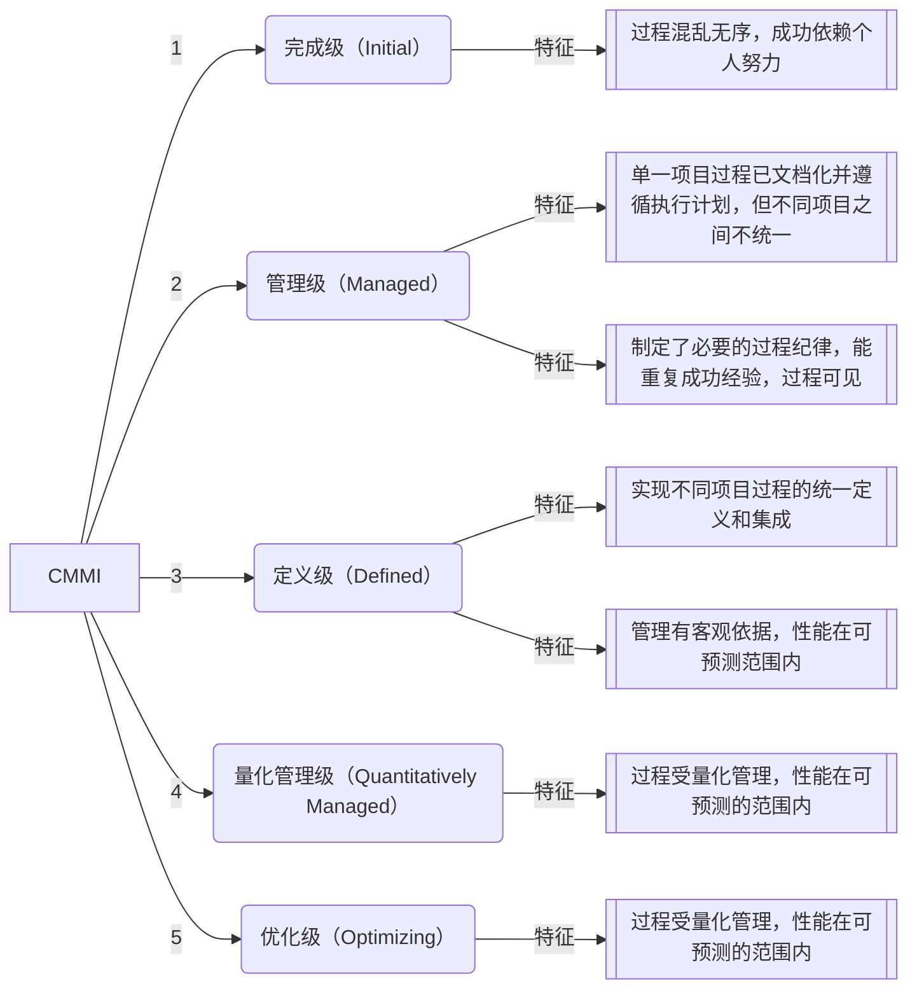

# CMMI-能力成熟度模型集成

```mermaid
flowchart LR
A["CMMI"]
A-->|1|A1("完成级（Initial）")
A1-->|特征|A11[["过程混乱无序，成功依赖个人努力"]]
A-->|2|A2("管理级（Managed）")
A2-->|特征|A21[["单一项目过程已文档化并遵循执行计划，但不同项目之间不统一"]]
A2-->|特征|A22[["制定了必要的过程纪律，能重复成功经验，过程可见"]]
A-->|3|A3("定义级（Defined）")
A3-->|特征|A31[["实现不同项目过程的统一定义和集成"]]
A3-->|特征|A32[["管理有客观依据，性能在可预测范围内"]]
A-->|4|A4("量化管理级（Quantitatively Managed）")
A4-->|特征|A41[["过程受量化管理，性能在可预测的范围内"]]
A-->|5|A5("优化级（Optimizing）")
A5-->|特征|A51[["过程受量化管理，性能在可预测的范围内"]]
```

