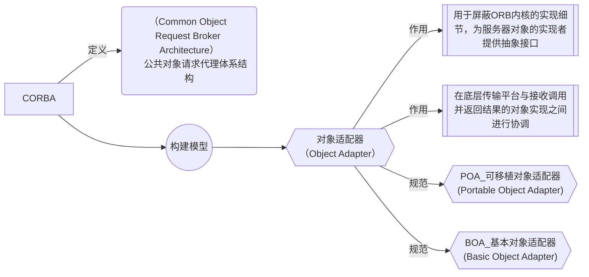

# CORBA构件模型

```mermaid
flowchart LR
A["CORBA"]
A-->|定义|B("（Common Object Request Broker Architecture）
     公共对象请求代理体系结构
     ")
A-->C((构建模型))
C-->C1{{"对象适配器
     （Object Adapter）
     "}}
C1-->|作用|C11[["用于屏蔽ORB内核的实现细节，为服务器对象的实现者提供抽象接口"]]
C1-->|作用|C12[["在底层传输平台与接收调用并返回结果的对象实现之间进行协调"]]
C1-->|规范|C13{{"POA_可移植对象适配器
             (Portable Object Adapter)
            "}}
C1-->|规范|C14{{"BOA_基本对象适配器
             (Basic Object Adapter)
            "}}
```

