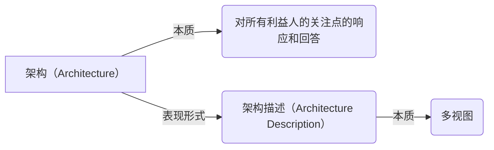
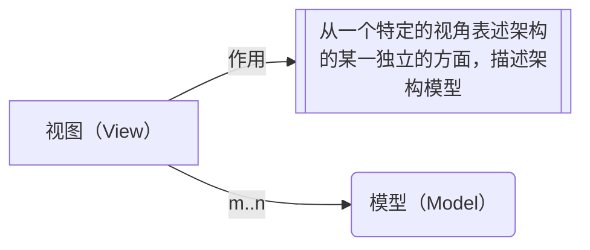

# 系统架构概述/ANS/IEEE1471-2000标准

```mermaid
flowchart LR
A["系统"]-->|作用|B("在特定环境中构建，为达成利益相关人的某些使命")
```

```mermaid
flowchart LR
A["架构（Architecture）"]-->|本质|B("对所有利益人的关注点的响应和回答")
A-->|表现形式|C("架构描述（Architecture Description）")
C-->|本质|C1("多视图")
```

```mermaid
flowchart LR
A["视图（View）"]-->|作用|B[["从一个特定的视角表述架构的某一独立的方面，描述架构模型"]]
A-->|m..n|C("模型（Model）")
```

```mermaid
flowchart LR
A["视角（Viewpoint）"]-->|含义|B["描述某个利益相关人所关注架构模型的某一方面（利益相关人的关注点）"]
```
