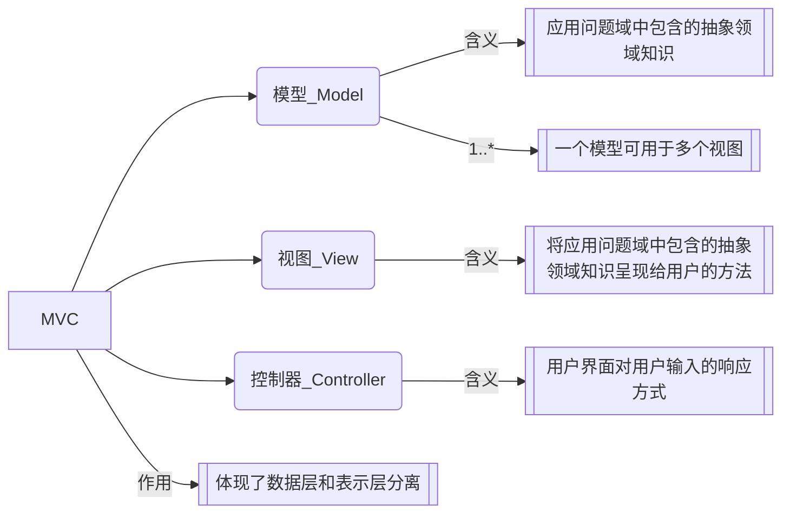

# MVC架构模式

```mermaid
graph LR
A[MVC]
A-->B(模型_Model)
A-->C(视图_View)
A-->D(控制器_Controller)
B-->|含义|B1[[应用问题域中包含的抽象领域知识]]
C-->|含义|C1[[将应用问题域中包含的抽象领域知识呈现给用户的方法]]
D-->|含义|D1[[用户界面对用户输入的响应方式]]
B-->|1..*|B2[[一个模型可用于多个视图]]
A-->|作用|E1[[体现了数据层和表示层分离]]
```
