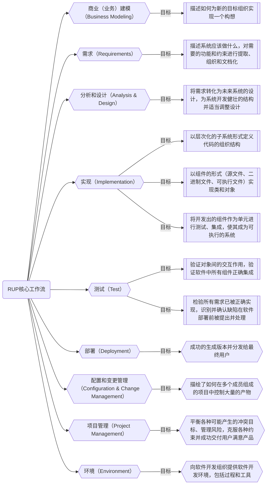

# RUP-4+1视图

---

> RUP：Rational Unified Process，统一软件开发过程

---

```mermaid
flowchart LR
A["4+1视图"]
A-->|4|B("逻辑视图")
B-->|用途|B1[["描述系统的功能需求，功能拆解后的组件关系、约束和边界"]]
B-->|关注角色|B2{{"最终用户（使用系统的外部用户）"}}
A-->|4|C("实现视图")
C-->|用途|C1[["描述系统的模块划分和组成，反映系统开发实施过程"]]
C-->|关注角色|C2{{"程序员"}}
A-->|4|D("进程视图")
D-->|用途|D1[["描述了系统中并发与同步的结构，是逻辑视图的一次执行实例"]]
D-->|关注角色|D2{{"系统集成人员"}}
A-->|4|E("部署视图")
E-->|用途|E1[["描述系统发布、安装、拓扑结构等物理部署情况"]]
E-->|关注角色|E2{{"系统工程师（运维人员）"}}
A-->|1|F(["用例视图（场景视图）"])
F-->|用途|F1[["可视化表达用户的功能性需求"]]
F-->|关注角色|F2{{"分析人员和测试人员"}}
```

---

> RUP：九大核心工作流

---

```mermaid
flowchart LR
A("RUP核心工作流")
A-->A1{{"商业（业务）建模（Business Modeling）"}}
A1-->|目标|A11[["描述如何为新的目标组织实现一个构想"]]
A-->A2{{"需求（Requirements）"}}
A2-->|目标|A21[["描述系统应该做什么，对需要的功能和约束进行提取、组织和文档化"]]
A-->A3{{"分析和设计（Analysis & Design）"}}
A3-->|目标|A31[["将需求转化为未来系统的设计，为系统开发健壮的结构并适当调整设计"]]
A-->A4{{"实现（Implementation）"}}
A4-->|目标|A41[["以层次化的子系统形式定义代码的组织结构"]]
A4-->|目标|A42[["以组件的形式（源文件、二进制文件、可执行文件）实现类和对象"]]
A4-->|目标|A43[["将开发出的组件作为单元进行测试、集成，使其成为可执行的系统"]]
A-->A5{{"测试（Test）"}}
A5-->|目标|A51[["验证对象间的交互作用，验证软件中所有组件正确集成"]]
A5-->|目标|A52[["检验所有需求已被正确实现，识别并确认缺陷在软件部署前被提出并处理"]]
A-->A6{{"部署（Deployment）"}}
A6-->|目标|A61{{"成功的生成版本并分发给最终用户"}}
A-->A7{{"配置和变更管理（Configuration & Change Management）"}}
A7-->|目标|A71{{"描绘了如何在多个成员组成的项目中控制大量的产物"}}
A-->A8{{"项目管理（Project Management）"}}
A8-->|目标|A81{{"平衡各种可能产生的冲突目标、管理风险，克服各种约束并成功交付用户满意产品"}}
A-->A9{{"环境（Environment）"}}
A9-->|目标|A91{{"向软件开发组织提供软件开发环境，包括过程和工具"}}
```
