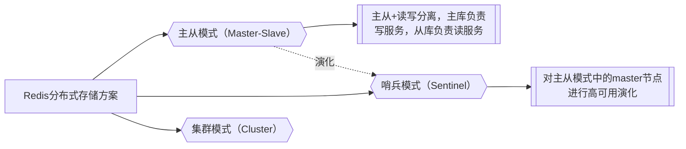
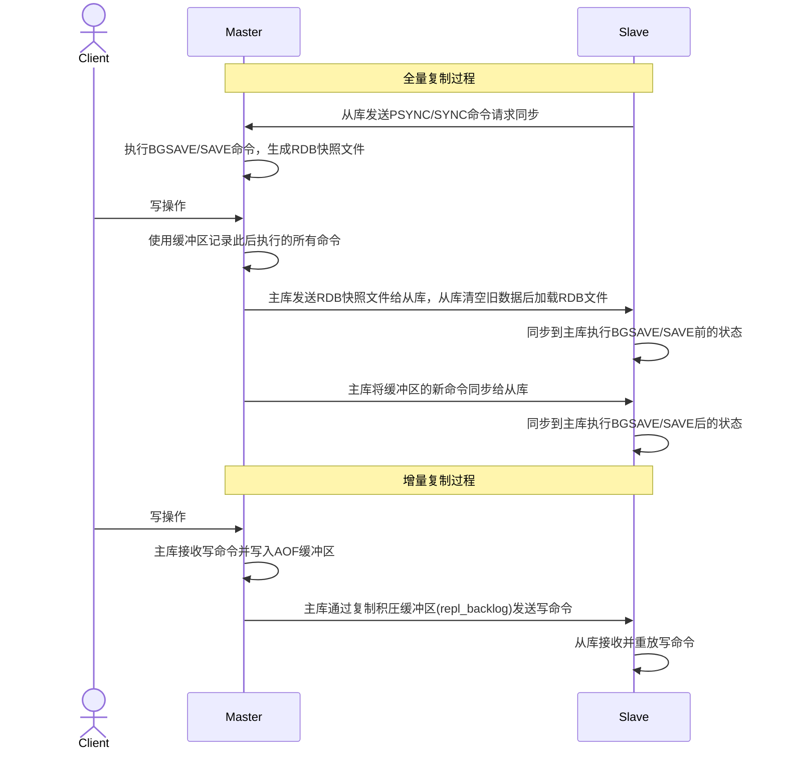
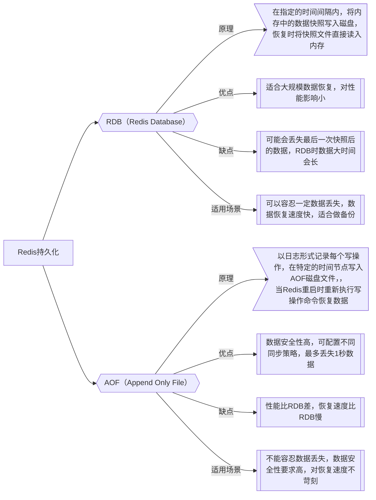

# Redis集群

---

> Redis分布式存储方案

---

```mermaid
flowchart LR

A["Redis分布式存储方案"]

A-->A1{{"主从模式（Master-Slave）"}}
A1-->A11[["主从+读写分离，主库负责写服务，从库负责读服务"]]

A-->A2{{"哨兵模式（Sentinel）"}}
A1-.->|演化|A2
A2-->A21[["对主从模式中的master节点进行高可用演化"]]

A-->A3{{"集群模式（Cluster）"}}
```

---

> 主从复制实现原理

---

```mermaid
sequenceDiagram
    actor Client
   
    Note over Master,Slave: 全量复制过程
    Slave->>Master: 从库发送PSYNC/SYNC命令请求同步
    Master->>Master: 执行BGSAVE/SAVE命令，生成RDB快照文件
    Client->>Master: 写操作
    Master->>Master: 使用缓冲区记录此后执行的所有命令
    Master->>Slave: 主库发送RDB快照文件给从库，从库清空旧数据后加载RDB文件
    Slave->>Slave: 同步到主库执行BGSAVE/SAVE前的状态
    Master->>Slave: 主库将缓冲区的新命令同步给从库
    Slave->>Slave: 同步到主库执行BGSAVE/SAVE后的状态

    Note over Master,Slave: 增量复制过程
    Client->>Master: 写操作
    Master->>Master: 主库接收写命令并写入AOF缓冲区
    Master->>Slave: 主库通过复制积圧缓冲区(repl_backlog)发送写命令
    Slave->>Slave: 从库接收并重放写命令
```

---

> Redis持久化机制

---

```mermaid
flowchart LR

A["Redis持久化"]

A-->A1{{"RDB（Redis Database）"}}
A1-->|原理|A11>"在指定的时间间隔内，将内存中的数据快照写入磁盘，
恢复时将快照文件直接读入内存"]
A1-->|优点|A12[["适合大规模数据恢复，对性能影响小"]]
A1-->|缺点|A13[["可能会丢失最后一次快照后的数据，RDB时数据大时间会长"]]
A1-->|适用场景|A14[["可以容忍一定数据丢失，数据恢复速度快，适合做备份"]]

A-->A2{{"AOF（Append Only File）"}}
A2-->|原理|A21>"以日志形式记录每个写操作，在特定的时间节点写入AOF磁盘文件，，
当Redis重启时重新执行写操作命令恢复数据"]
A2-->|优点|A22[["数据安全性高，可配置不同同步策略，最多丢失1秒数据"]]
A2-->|缺点|A23[["性能比RDB差，恢复速度比RDB慢"]]
A2-->|适用场景|A24[["不能容忍数据丢失，数据安全性要求高，对恢复速度不苛刻"]]

```

