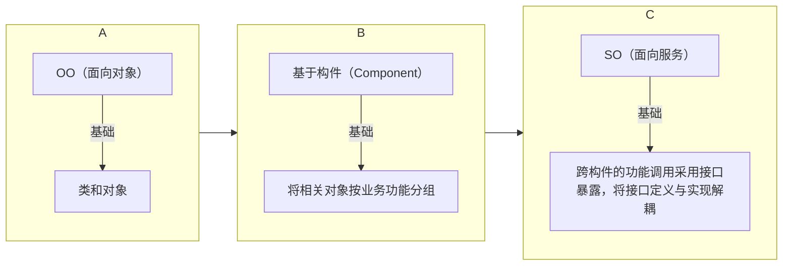
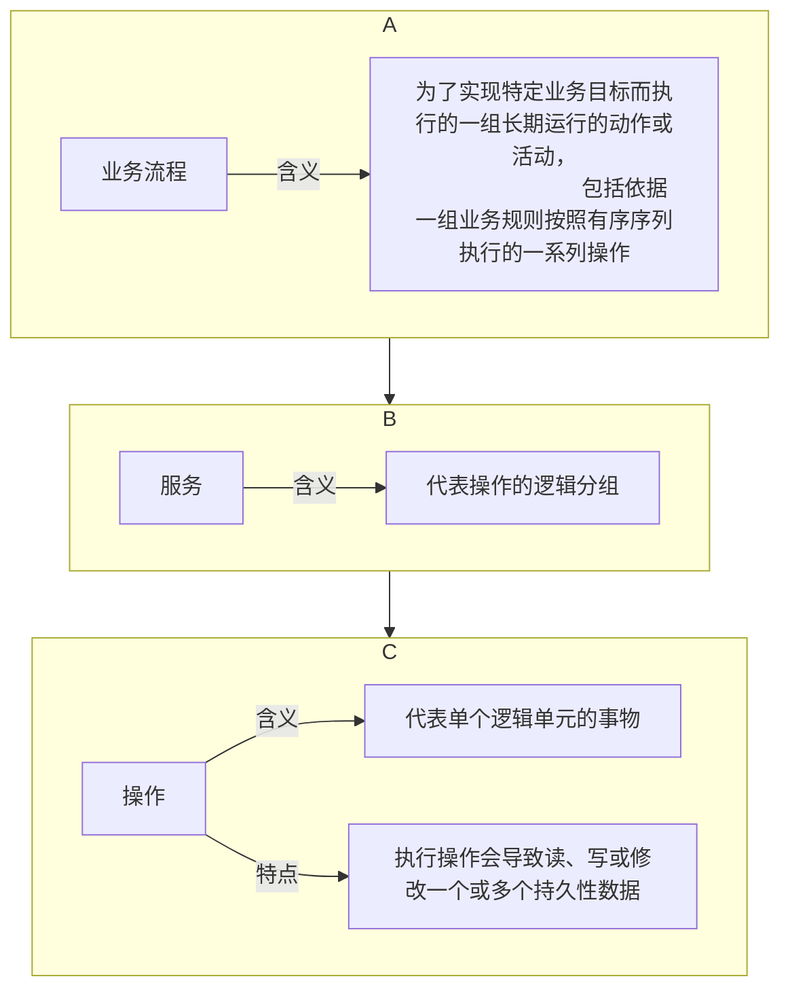

# SO面向服务的开发方法

> 递进抽象层次

```mermaid
flowchart LR
    subgraph A
    a1["OO（面向对象）"]-->|基础|a2["类和对象"]
    end
    subgraph B
    b1["基于构件（Component）"]-->|基础|b2["将相关对象按业务功能分组"]
    end
    subgraph C
    c1["SO（面向服务）"]-->|基础|c2["跨构件的功能调用采用接口暴露，将接口定义与实现解耦"]
    end
A-->B-->C
```

> SO(Service-Oriented)3个从高到低主要抽象级别

```mermaid
flowchart TB
    subgraph A
    a1["业务流程"]-->|含义|a2["为了实现特定业务目标而执行的一组长期运行的动作或活动，
                           包括依据一组业务规则按照有序序列执行的一系列操作"]
    end
    subgraph B
    b1["服务"]-->|含义|b2["代表操作的逻辑分组"]
    end
    subgraph C
    c1["操作"]-->|含义|c2["代表单个逻辑单元的事物"]
    c1-->|特点|c3["执行操作会导致读、写或修改一个或多个持久性数据"]
    end
A-->B-->C
```

