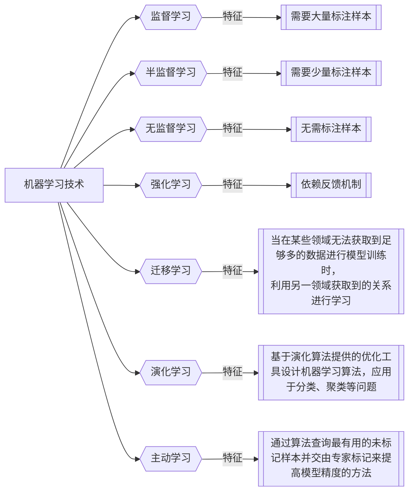

# 人工智能-机器学习

```mermaid
flowchart LR
A["机器学习技术"]
A-->A1{{"监督学习"}}-->|特征|A11[["需要大量标注样本"]]
A-->A2{{"半监督学习"}}-->|特征|A21[["需要少量标注样本"]]
A-->A3{{"无监督学习"}}-->|特征|A31[["无需标注样本"]]
A-->A4{{"强化学习"}}-->|特征|A41[["依赖反馈机制"]]

A-->A5{{"迁移学习"}}-->|特征|A51[["当在某些领域无法获取到足够多的数据进行模型训练时，
利用另一领域获取到的关系进行学习"]]
A-->A6{{"演化学习"}}-->|特征|A61[["基于演化算法提供的优化工具设计机器学习算法，应用于分类、聚类等问题"]]
A-->A7{{"主动学习"}}-->|特征|A71[["通过算法查询最有用的未标记样本并交由专家标记来提高模型精度的方法"]]
```
