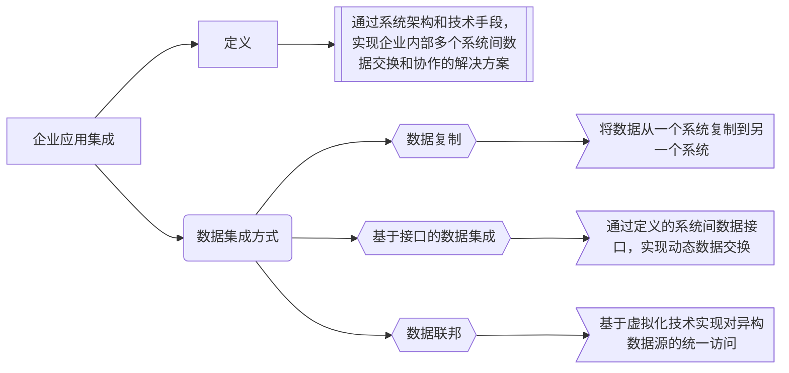

# 企业应用集成-EAI

```mermaid
flowchart LR

A["企业应用集成"]

A-->A0["定义"]
A0-->A01[["通过系统架构和技术手段，实现企业内部多个系统间数据交换和协作的解决方案"]]

A-->A1("数据集成方式")
A1-->A11{{"数据复制"}}
A11-->A111>"将数据从一个系统复制到另一个系统"]
A1-->A12{{"基于接口的数据集成"}}
A12-->A121>"通过定义的系统间数据接口，实现动态数据交换"]
A1-->A13{{"数据联邦"}}
A13-->A131>"基于虚拟化技术实现对异构数据源的统一访问"]
```

