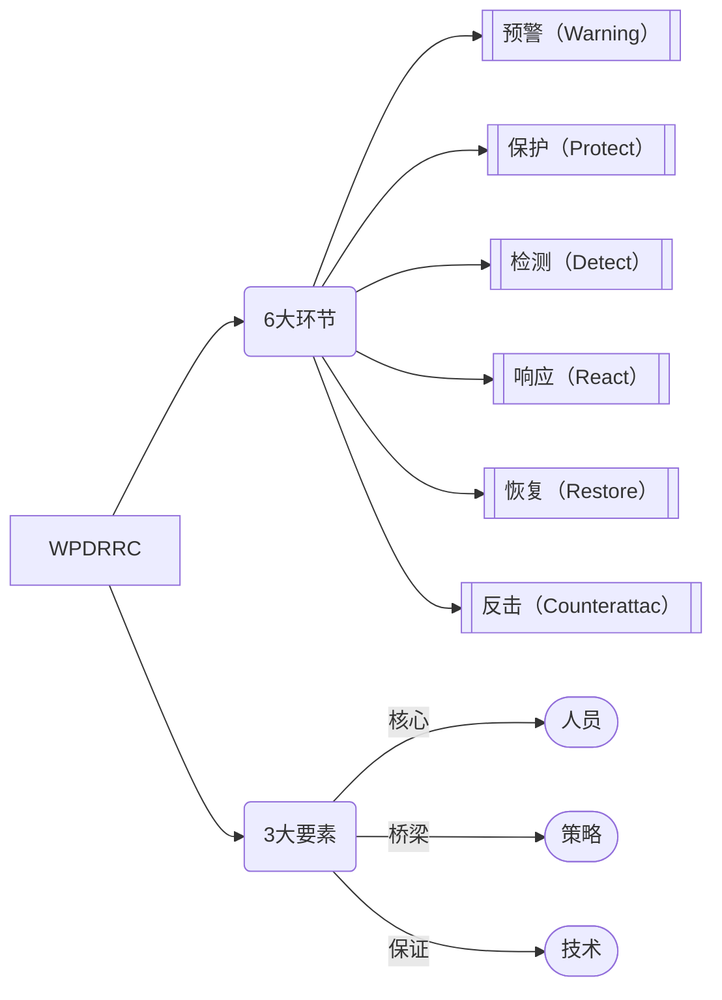

# 信息安全整体架构设计-WPDRRC模型

```mermaid
flowchart LR
A["WPDRRC"]
A-->A1("6大环节")
A1-->A11[["预警（Warning）"]]
A1-->A12[["保护（Protect）"]]
A1-->A13[["检测（Detect）"]]
A1-->A14[["响应（React）"]]
A1-->A15[["恢复（Restore）"]]
A1-->A16[["反击（Counterattac）"]]
A-->A2("3大要素")
A2-->|核心|A21(["人员"])
A2-->|桥梁|A22(["策略"])
A2-->|保证|A23(["技术"])
```
