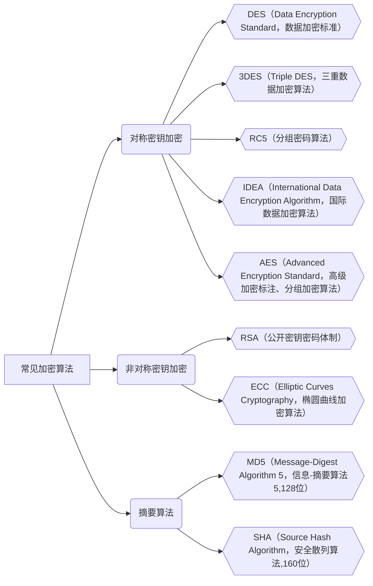

# 加密算法

```mermaid
flowchart LR

A["常见加密算法"]

A-->A1("对称密钥加密")
A1-->A11{{"DES（Data Encryption Standard，数据加密标准）"}}
A1-->A12{{"3DES（Triple DES，三重数据加密算法）"}}
A1-->A13{{"RC5（分组密码算法）"}}
A1-->A14{{"IDEA（International Data Encryption Algorithm，国际数据加密算法）"}}
A1-->A15{{"AES（Advanced Encryption Standard，高级加密标注、分组加密算法）"}}

A-->A2("非对称密钥加密")
A2-->A21{{"RSA（公开密钥密码体制）"}}
A2-->A22{{"ECC（Elliptic Curves Cryptography，椭圆曲线加密算法）"}}

A-->A3("摘要算法")
A3-->A31{{"MD5（Message-Digest Algorithm 5，信息-摘要算法5,128位）"}}
A3-->A32{{"SHA（Source Hash Algorithm，安全散列算法,160位）"}}
```
