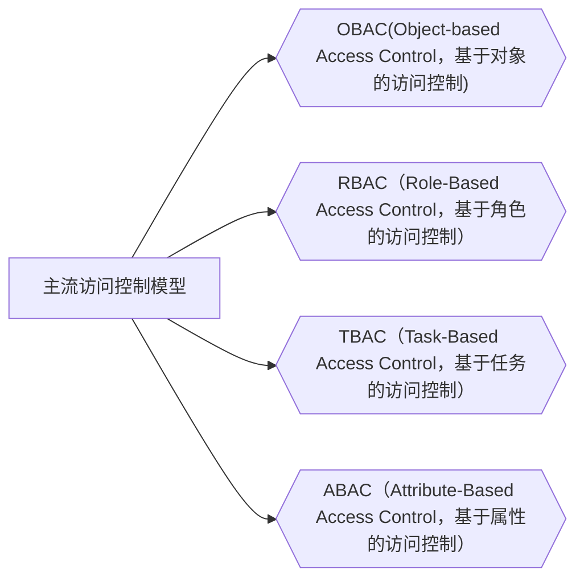
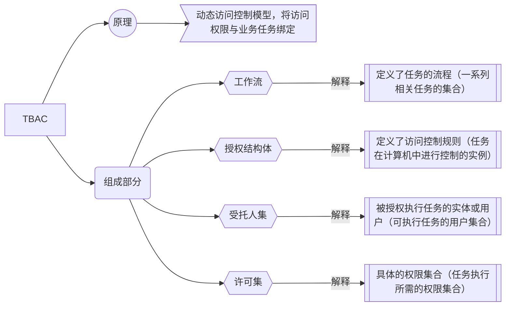

# 四种主流访问控制模型

```mermaid
flowchart LR

A["主流访问控制模型"]
A-->A1{{"OBAC(Object-based Access Control，基于对象的访问控制)"}}
A-->A2{{"RBAC（Role-Based Access Control，基于角色的访问控制）"}}
A-->A3{{"TBAC（Task-Based Access Control，基于任务的访问控制）"}}
A-->A4{{"ABAC（Attribute-Based Access Control，基于属性的访问控制）"}}
```

---

> TBAC（Task-Based Access Control，基于任务的访问控制）

---

```mermaid
flowchart LR
A["TBAC"]

A-->A0(("原理"))
A0-->A01>"动态访问控制模型，将访问权限与业务任务绑定"]

A-->A1("组成部分")
A1-->A11{{"工作流"}}
A11-->|解释|A111[["定义了任务的流程（一系列相关任务的集合）"]]
A1-->A12{{"授权结构体"}}
A12-->|解释|A121[["定义了访问控制规则（任务在计算机中进行控制的实例）"]]
A1-->A13{{"受托人集"}}
A13-->|解释|A131[["被授权执行任务的实体或用户（可执行任务的用户集合）"]]
A1-->A14{{"许可集"}}
A14-->|解释|A141[["具体的权限集合（任务执行所需的权限集合）"]]


```

