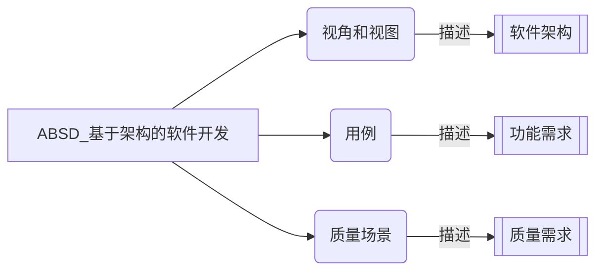
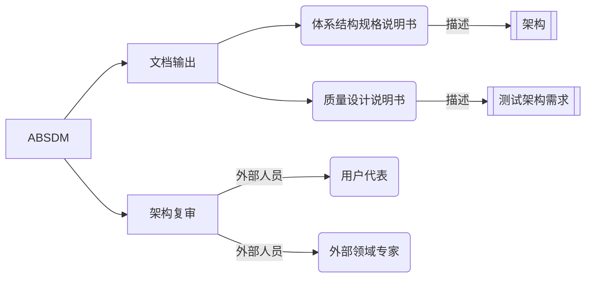

# 基于架构的软件开发

```mermaid
graph LR
A[ABSD_基于架构的软件开发]
A --> B(视角和视图)
B --> |描述|B1[[软件架构]]
A --> C(用例)
C -->  |描述|C1[[功能需求]]
A --> D(质量场景)
D -->  |描述|D1[[质量需求]]
```

```mermaid
graph LR
A[ABSDM]
A-->B[文档输出]
B-->C(体系结构规格说明书)
C-->|描述|C1[[架构]]
B-->D(质量设计说明书)
D-->|描述|D1[[测试架构需求]]
A-->E[架构复审]
E-->|外部人员|E1(用户代表)
E-->|外部人员|E2(外部领域专家)
```
