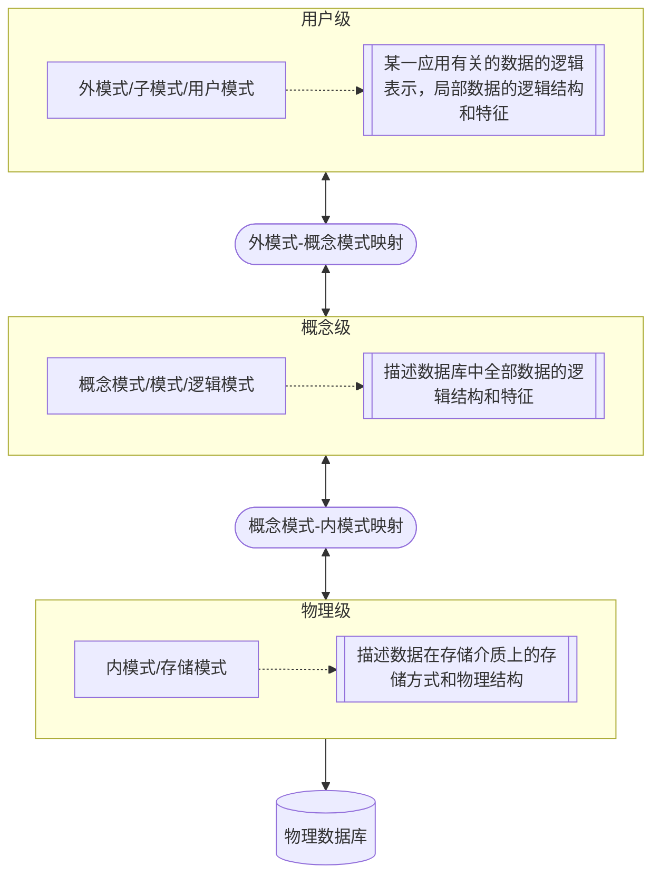

# 数据库-三级模式&二级隐射

---

> DML：Data Manipulation Language，数据操纵语言
> 
> DDL：Data Definition Language，数据库定义语言
> 
> DCL：Data Control Language，数据库控制语言
> 
> TCL：Transaction Control Language，事物控制语言

```mermaid
flowchart TB
subgraph 用户级
A["外模式/子模式/用户模式"]
A-.->A1[["某一应用有关的数据的逻辑表示，局部数据的逻辑结构和特征"]]
end

B(["外模式-概念模式映射"])
subgraph 概念级
C["概念模式/模式/逻辑模式"]
C-.->C1[["描述数据库中全部数据的逻辑结构和特征"]]
end

D(["概念模式-内模式映射"])

subgraph 物理级
E["内模式/存储模式"]
E-.->E1[["描述数据在存储介质上的存储方式和物理结构"]]
end
用户级<-->B<-->概念级
概念级<-->D<-->物理级
物理级-->F[("物理数据库")]
```
