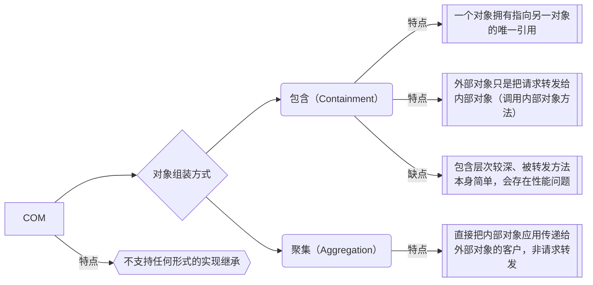

# COM构件架构

```mermaid
flowchart LR
A["COM"]
A-->B{"对象组装方式"}
B-->B1("包含（Containment）")
B1-->|特点|B11[["一个对象拥有指向另一对象的唯一引用"]]
B1-->|特点|B12[["外部对象只是把请求转发给内部对象（调用内部对象方法）"]]
B1-->|缺点|B13[["包含层次较深、被转发方法本身简单，会存在性能问题"]]
B-->B2("聚集（Aggregation）")
B2-->|特点|B21[["直接把内部对象应用传递给外部对象的客户，非请求转发"]]
A-->|特点|C{{"不支持任何形式的实现继承"}}
```
