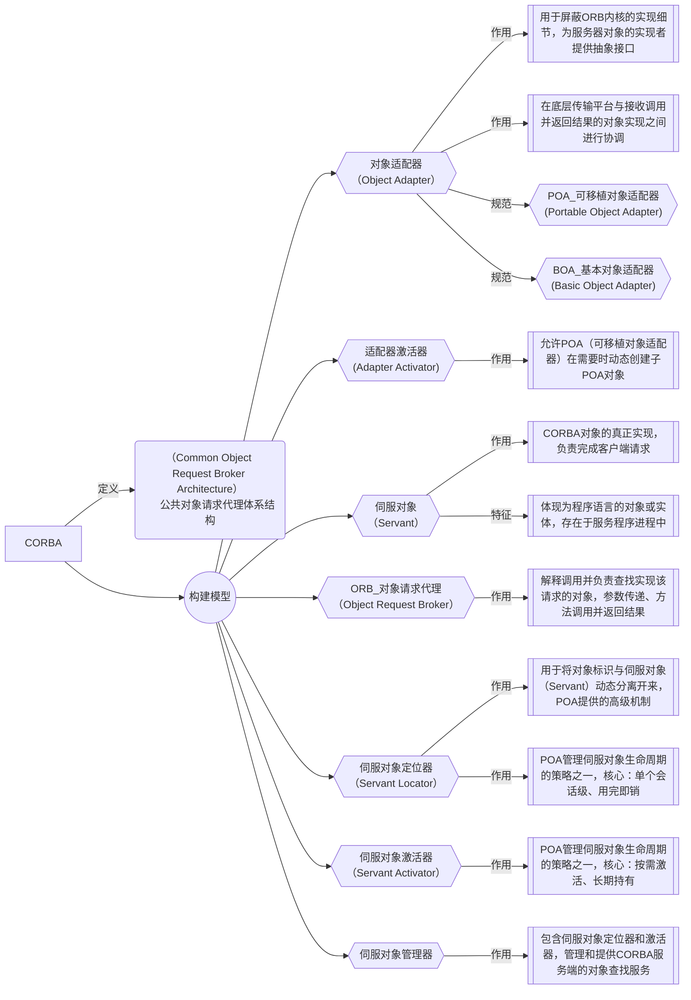

# CORBA构件模型

```mermaid
flowchart LR
A["CORBA"]
A-->|定义|B("（Common Object Request Broker Architecture）
     公共对象请求代理体系结构
     ")
A-->C((构建模型))
C-->C1{{"对象适配器
     （Object Adapter）
     "}}
C1-->|作用|C11[["用于屏蔽ORB内核的实现细节，为服务器对象的实现者提供抽象接口"]]
C1-->|作用|C12[["在底层传输平台与接收调用并返回结果的对象实现之间进行协调"]]
C1-->|规范|C13{{"POA_可移植对象适配器
             (Portable Object Adapter)
            "}}
C1-->|规范|C14{{"BOA_基本对象适配器
             (Basic Object Adapter)
            "}}
C-->C2{{"适配器激活器
        (Adapter Activator)
      "}}
C2-->|作用|C21[["允许POA（可移植对象适配器）在需要时动态创建子POA对象"]]
C-->C3{{"伺服对象
       （Servant）
      "}}
C3-->|作用|C31[["CORBA对象的真正实现，负责完成客户端请求"]]
C3-->|特征|C32[["体现为程序语言的对象或实体，存在于服务程序进程中"]]
C-->C4{{"ORB_对象请求代理
       （Object Request Broker）
      "}}
C4-->|作用|C41[["解释调用并负责查找实现该请求的对象，参数传递、方法调用并返回结果"]]
C-->C5{{"伺服对象定位器
       （Servant Locator）
      "}}
C5-->|作用|C51[["用于将对象标识与伺服对象（Servant）动态分离开来，POA提供的高级机制"]]
C5-->|作用|C52[["POA管理伺服对象生命周期的策略之一，核心：单个会话级、用完即销"]]
C-->C6{{"伺服对象激活器
       （Servant Activator）
      "}}
C6-->|作用|C61[["POA管理伺服对象生命周期的策略之一，核心：按需激活、长期持有"]]
C-->C7{{"伺服对象管理器"}}
C7-->|作用|C71[["包含伺服对象定位器和激活器，管理和提供CORBA服务端的对象查找服务"]]
```
