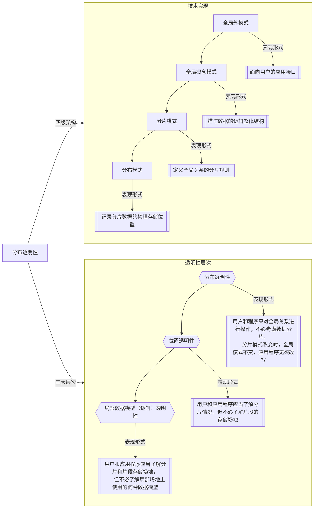

# 分布式架构-分布透明性

```mermaid
flowchart LR
A["分布透明性"]
subgraph 技术实现
direction TB
B1["全局外模式"]
B1-->B2
B1-->|表现形式|B11[["面向用户的应用接口"]]
B2["全局概念模式"]
B2-->B3
B2-->|表现形式|B21[["描述数据的逻辑整体结构"]]
B3["分片模式"]
B3-->B4
B3-->|表现形式|B31[["定义全局关系的分片规则"]]
B4["分布模式"]
B4-->|表现形式|B41[["记录分片数据的物理存储位置"]]
end
subgraph 透明性层次
direction TB
C1{{"分布透明性"}}
C1-->C2
C1-->|表现形式|C11[["用户和程序只对全局关系进行操作，不必考虑数据分片，
      分片模式改变时，全局模式不变，应用程序无须改写"]]
C2{{"位置透明性"}}
C2-->C3
C2-->|表现形式|C21[["用户和应用程序应当了解分片情况，但不必了解片段的存储场地"]]
C3{{"局部数据模型（逻辑）透明性"}}
C3-->|表现形式|C31[["用户和应用程序应当了解分片和片段存储场地，
      但不必了解局部场地上使用的何种数据模型"]]
end
A-->|四级架构|技术实现
A-->|三大层次|透明性层次
```
