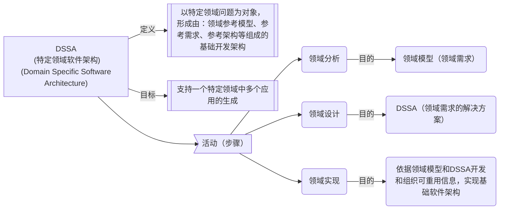

# 特定领域软件架构

```mermaid
flowchart LR
A["DSSA
 (特定领域软件架构)
 (Domain Specific Software Architecture)
 "]
A-->|定义|B[["以特定领域问题为对象，
形成由：领域参考模型、参考需求、参考架构等组成的基础开发架构
"]]
A-->|目标|C[["支持一个特定领域中多个应用的生成"]]
A-->D>"活动（步骤）"]
D-->D1("领域分析")
D1-->|目的|D11("领域模型（领域需求）")
D-->D2("领域设计")
D2-->|目的|D21("DSSA（领域需求的解决方案）")
D-->D3("领域实现")
D3-->|目的|D31("依据领域模型和DSSA开发和组织可重用信息，实现基础软件架构")
```
