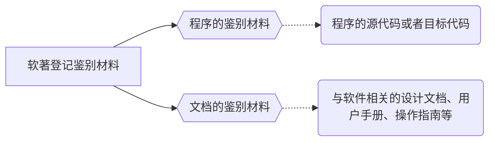
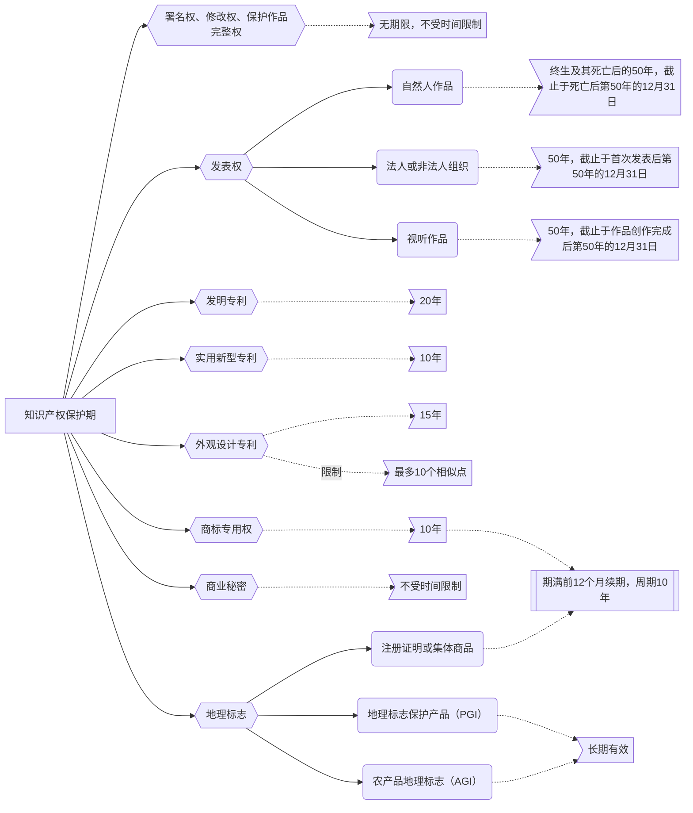
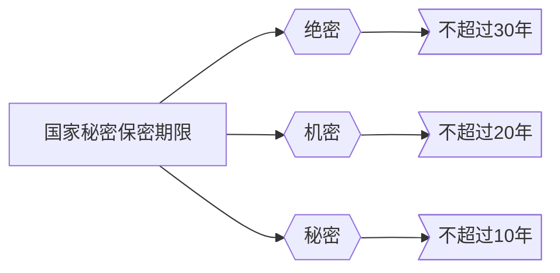

# 知识产权

---

> 软件著作权

----

```mermaid
flowchart LR
A["软著登记鉴别材料"]
A-->A1{{"程序的鉴别材料"}}
A1-.->A11("程序的源代码或者目标代码")
A-->A2{{"文档的鉴别材料"}}
A2-.->A21("与软件相关的设计文档、用户手册、操作指南等")
```

---

> 知识产权保护期

---

```mermaid
flowchart LR
A["知识产权保护期"]
A-->A1{{"署名权、修改权、保护作品完整权"}}-.->A11>"无期限，不受时间限制"]
A-->A2{{"发表权"}}-->A21("自然人作品")
A2-->A22("法人或非法人组织")
A2-->A23("视听作品")
A21-.->A211>"终生及其死亡后的50年，截止于死亡后第50年的12月31日"]
A22-.->A221>"50年，截止于首次发表后第50年的12月31日"]
A23-.->A231>"50年，截止于作品创作完成后第50年的12月31日"]

A-->A3{{"发明专利"}}-.->A31>"20年"]
A-->A4{{"实用新型专利"}}-.->A41>"10年"]
A-->A5{{"外观设计专利"}}-.->A51>"15年"]
A5-.限制.->A52>"最多10个相似点"]

A-->A6{{"商标专用权"}}-.->A61>"10年"]-.->A611[["期满前12个月续期，周期10年"]]

A-->A7{{"商业秘密"}}-.->A71>"不受时间限制"]

A-->A8{{"地理标志"}}-->A81("注册证明或集体商品")
A8-->A82("地理标志保护产品（PGI）")-.->A821>"长期有效"]
A8-->A83("农产品地理标志（AGI）")
A81-.->A611
A83-.->A821
```

---

> 国家秘密

---

```mermaid
flowchart LR
A["国家秘密保密期限"]
A-->A1{{"绝密"}}-->A11>"不超过30年"]
A-->21{{"机密"}}-->A21>"不超过20年"]
A-->31{{"秘密"}}-->A31>"不超过10年"]
```
