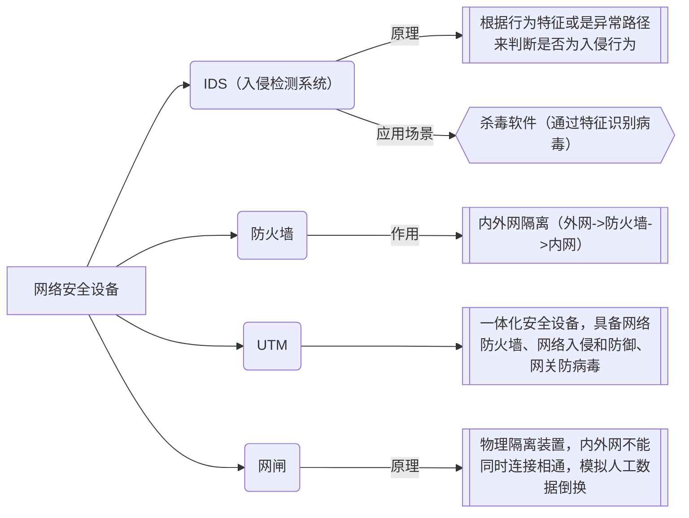

# 网络安全-设备

```mermaid
flowchart LR
A["网络安全设备"]
A-->B("IDS（入侵检测系统）")
B-->|原理|B1[["根据行为特征或是异常路径来判断是否为入侵行为"]]
B-->|应用场景|B2{{"杀毒软件（通过特征识别病毒）"}}
A-->C("防火墙")
C-->|作用|C1[["内外网隔离（外网->防火墙->内网）"]]
A-->D("UTM")
D-->D1[["一体化安全设备，具备网络防火墙、网络入侵和防御、网关防病毒"]]
A-->E("网闸")
E-->|原理|E1[["物理隔离装置，内外网不能同时连接相通，模拟人工数据倒换"]]
```

