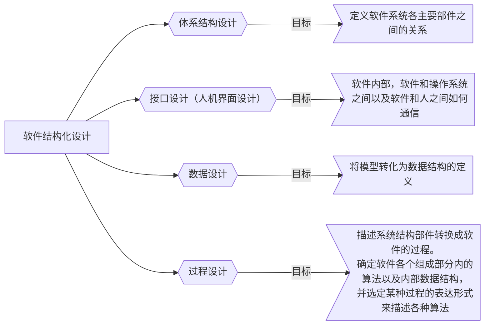
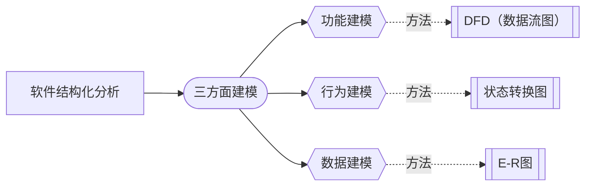
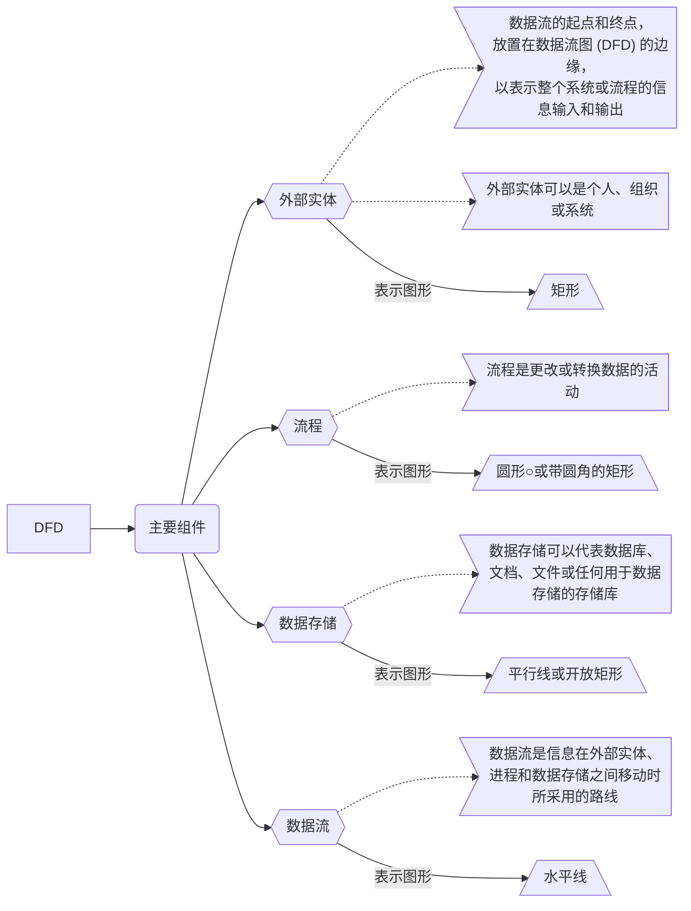

# 软件结构化设计&分析

---

> 软件结构化设计

----

```mermaid
flowchart LR

A["软件结构化设计"]
A-->A1{{"体系结构设计"}}-->|目标|A11>"定义软件系统各主要部件之间的关系"]
A-->A2{{"接口设计（人机界面设计）"}}-->|目标|A21>"软件内部，软件和操作系统之间以及软件和人之间如何通信"]
A-->A3{{"数据设计"}}-->|目标|A31>"将模型转化为数据结构的定义"]
A-->A4{{"过程设计"}}-->|目标|A41>"描述系统结构部件转换成软件的过程。
确定软件各个组成部分内的算法以及内部数据结构，
并选定某种过程的表达形式来描述各种算法"]
```

---

> 软件结构化分析

---

```mermaid
flowchart LR

A["软件结构化分析"]
A-->A1(["三方面建模"])
A1-->A11{{"功能建模"}}-.->|"方法"|A111[["DFD（数据流图）"]]
A1-->A12{{"行为建模"}}-.->|"方法"|A121[["状态转换图"]]
A1-->A13{{"数据建模"}}-.->|"方法"|A131[["E-R图"]]
```

---

> DFD（数据流图）

---

```mermaid
flowchart LR

A["DFD"]

A-->A1("主要组件")
A1-->A11{{"外部实体"}}
A11-.->A111>"数据流的起点和终点，
放置在数据流图 (DFD) 的边缘，
以表示整个系统或流程的信息输入和输出"]
A11-.->A112>"外部实体可以是个人、组织或系统"]
A11-->|表示图形|A113[/"矩形"\]

A1-->A12{{"流程"}}
A12-.->121>"流程是更改或转换数据的活动"]
A12-->|表示图形|A122[/"圆形○或带圆角的矩形"\]

A1-->A13{{"数据存储"}}
A13-.->131>"数据存储可以代表数据库、文档、文件或任何用于数据存储的存储库"]
A13-->|表示图形|A132[/"平行线或开放矩形"\]

A1-->A14{{"数据流"}}
A14-.->141>"数据流是信息在外部实体、进程和数据存储之间移动时所采用的路线"]
A14-->|表示图形|A142[/"水平线"\]
```
