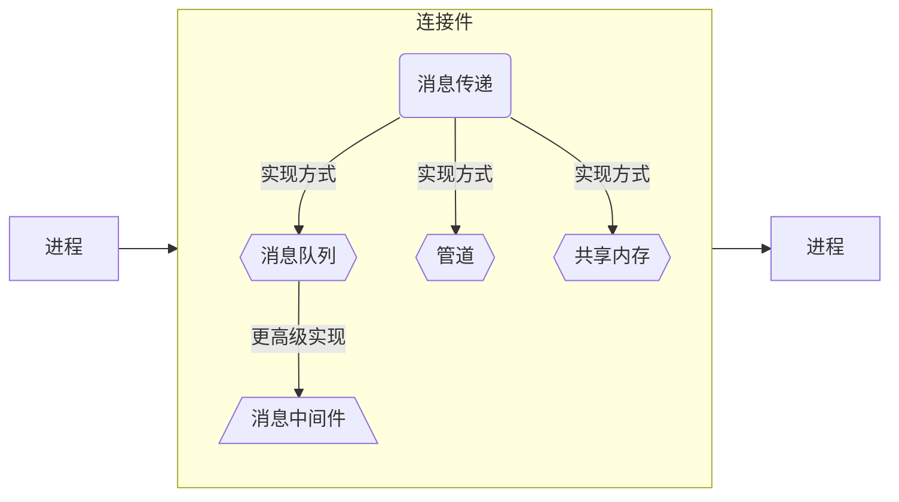

# 进程通信架构风格

---

> 目标：专注于多个独立进程间如何通信

---

```mermaid
flowchart LR
A["进程"]
subgraph 连接件
direction TB
B("消息传递")
B-->|实现方式|B1{{"消息队列"}}
B-->|实现方式|B2{{"管道"}}
B-->|实现方式|B3{{"共享内存"}}
B1-->|更高级实现|B11[/"消息中间件"\]
end
C["进程"]
A-->连接件
连接件-->C
```
