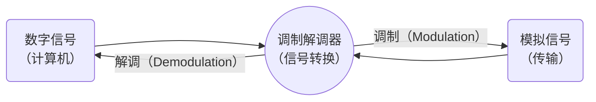
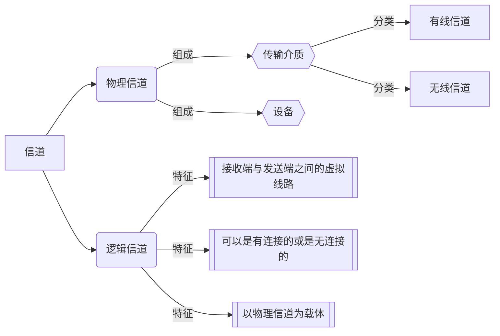
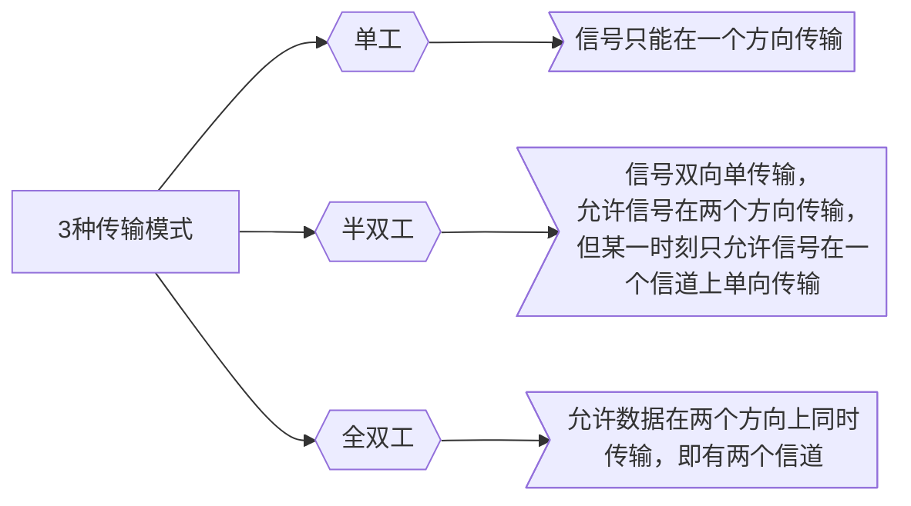

# 通信技术

---

> 调制解调技术

---

```mermaid
flowchart LR
A("数字信号
  （计算机）")
A-->B(("调制解调器
  （信号转换）"))
B-->|"调制（Modulation）"|C("模拟信号
  （传输）")
C-->B-->|"解调（Demodulation）"|A
```

---

> 通信信道

----

```mermaid
flowchart LR

A["信道"]
A-->A1("物理信道")
A1-->|组成|A11{{"传输介质"}}
A1-->|组成|A12{{"设备"}}
A11-->|分类|A111["有线信道"]
A11-->|分类|A112["无线信道"]
A-->A2("逻辑信道")
A2-->|特征|A21[["接收端与发送端之间的虚拟线路"]]
A2-->|特征|A22[["可以是有连接的或是无连接的"]]
A2-->|特征|A23[["以物理信道为载体"]]
```

```mermaid
flowchart LR

A["3种传输模式"]

A-->A1{{"单工"}}
A-->A2{{"半双工"}}
A-->A3{{"全双工"}}

A1-->A11>"信号只能在一个方向传输"]
A2-->A21>"信号双向单传输，
允许信号在两个方向传输，但某一时刻只允许信号在一个信道上单向传输"]
A3-->A31>"允许数据在两个方向上同时传输，即有两个信道"]
```
