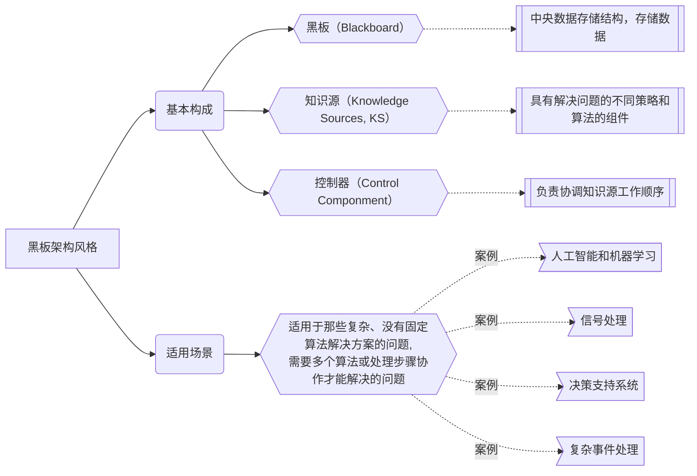

# 黑板架构风格

```mermaid
flowchart LR

A["黑板架构风格"]

A-->A1("基本构成")
A1-->A11{{"黑板（Blackboard）"}}
A11-.->A111[["中央数据存储结构，存储数据"]]
A1-->A12{{"知识源（Knowledge Sources, KS）"}}
A12-.->A121[["具有解决问题的不同策略和算法的组件"]]
A1-->A13{{"控制器（Control Componment）"}}
A13-.->A131[["负责协调知识源工作顺序"]]

A-->A2("适用场景")
A2-->A21{{"适用于那些复杂、没有固定算法解决方案的问题,
需要多个算法或处理步骤协作才能解决的问题"}}
A21-.->|案例|A211>"人工智能和机器学习"]
A21-.->|案例|A212>"信号处理"]
A21-.->|案例|A213>"决策支持系统"]
A21-.->|案例|A214>"复杂事件处理"]
```
