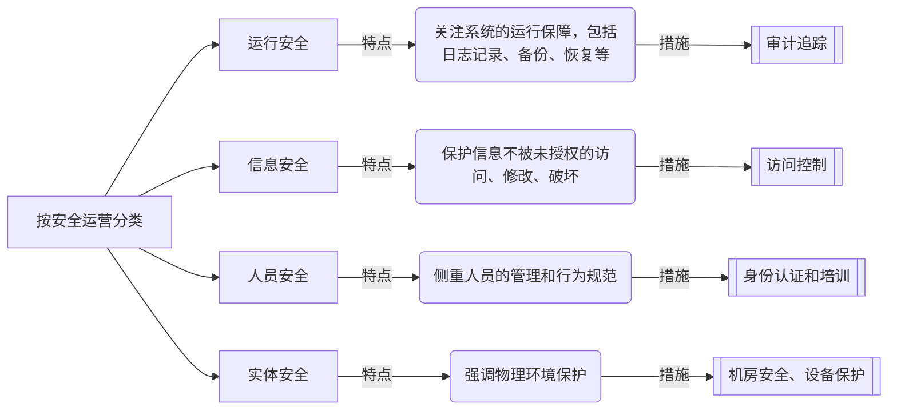

# 信息系统安全

--- 

> ## 按安全运营分类

---

```mermaid
flowchart LR

A["按安全运营分类"]

A-->A1["运行安全"]
A1-->|特点|A11("关注系统的运行保障，包括日志记录、备份、恢复等")-->|措施|A111[["审计追踪"]]

A-->A2["信息安全"]
A2-->|特点|A21("保护信息不被未授权的访问、修改、破坏")-->|措施|A211[["访问控制"]]

A-->A3["人员安全"]
A3-->|特点|A31("侧重人员的管理和行为规范")-->|措施|A311[["身份认证和培训"]]

A-->A4["实体安全"]
A4-->|特点|A41("强调物理环境保护")-->|措施|A411[["机房安全、设备保护"]]
```

