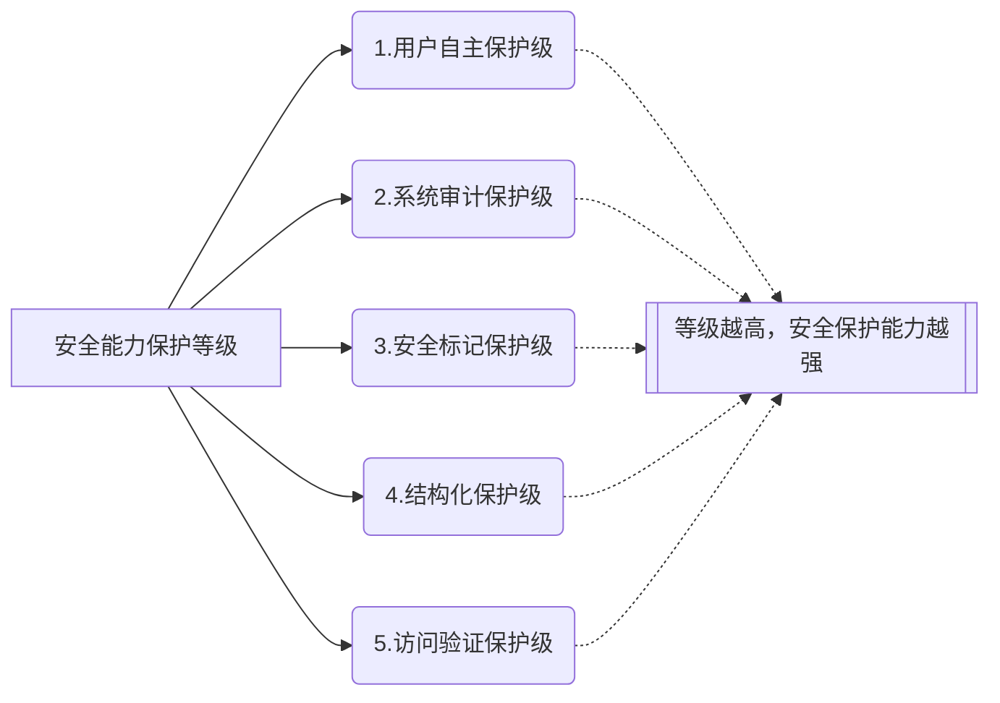

# 信息系统安全保护能力等级

```mermaid
flowchart LR

A[安全能力保护等级]

A-->A1("1.用户自主保护级")
A-->A2("2.系统审计保护级")
A-->A3("3.安全标记保护级")
A-->A4("4.结构化保护级")
A-->A5("5.访问验证保护级")

E0[["等级越高，安全保护能力越强"]]
A1-.->E0
A2-.->E0
A3-.->E0
A4-.->E0
A5-.->E0
```
