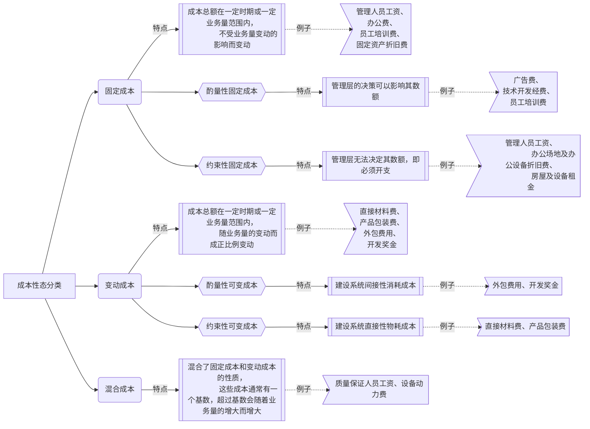

# 信息系统成本

---

> ## 成本：信息系统生命周期内各阶段的所有投入之和。

---

```mermaid
flowchart LR

A["成本性态分类"]

A-->A1("固定成本")
A1-->|特点|A11[["成本总额在一定时期或一定业务量范围内，
                不受业务量变动的影响而变动"]]
A11-.->|例子|A111>"管理人员工资、
                  办公费、
                  员工培训费、
                  固定资产折旧费"]

A1-->A121{{"酌量性固定成本"}}
A121-->|特点|A1211[["管理层的决策可以影响其数额"]]
A1211-.->|例子|A12111>"广告费、
                      技术开发经费、
                      员工培训费"]

A1-->A122{{"约束性固定成本"}}
A122-->|特点|A1221[["管理层无法决定其数额，即必须开支"]]
A1221-.->|例子|A12211>"管理人员工资、
                      办公场地及办公设备折旧费、
                      房屋及设备租金"]

A-->A2("变动成本")
A2-->|特点|A21[["成本总额在一定时期或一定业务量范围内，
                随业务量的变动而成正比例变动"]]
A21-.->|例子|A211>"直接材料费、
                  产品包装费、
                  外包费用、
                  开发奖金"]

A2-->A221{{"酌量性可变成本"}}
A221-->|特点|A2211[["建设系统间接性消耗成本"]]
A2211-.->|例子|A22111>"外包费用、开发奖金"]

A2-->A222{{"约束性可变成本"}}
A222-->|特点|A2221[["建设系统直接性物耗成本"]]
A2221-.->|例子|A22211>"直接材料费、产品包装费"]


A-->A3("混合成本")
A3-->|特点|A31[["混合了固定成本和变动成本的性质，
                这些成本通常有一个基数，超过基数会随着业务量的增大而增大"]]
A31-.->|例子|A311>"质量保证人员工资、设备动力费"]
```
