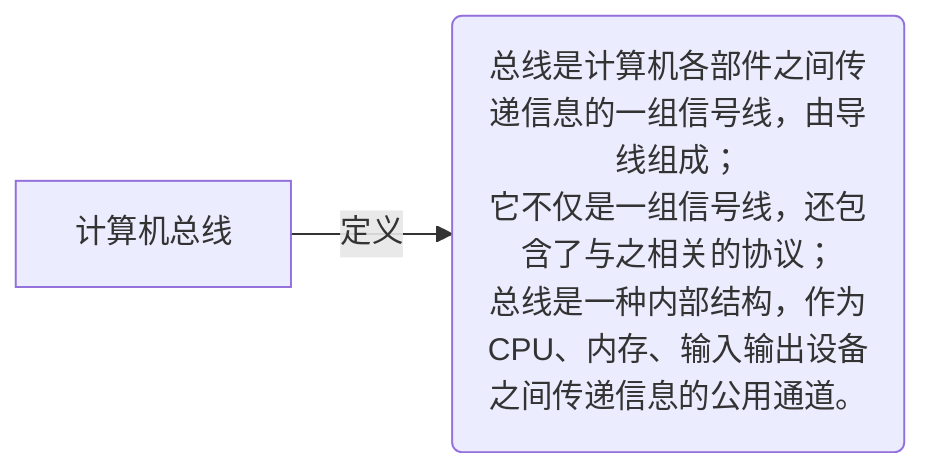
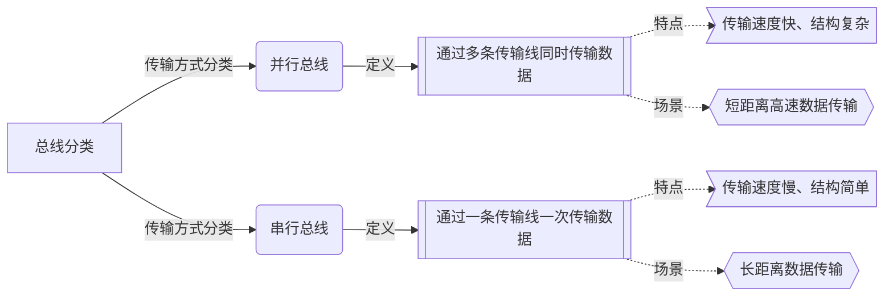
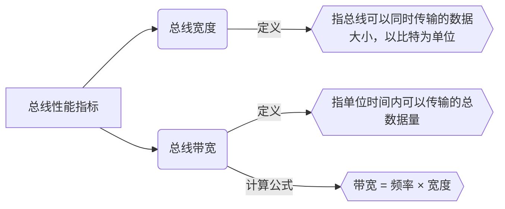
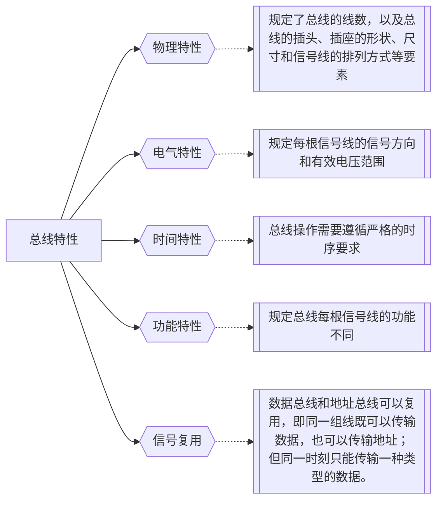

# 计算机总线

```mermaid
flowchart LR

A["计算机总线"]

A-->|定义|A1("总线是计算机各部件之间传递信息的一组信号线，由导线组成；
它不仅是一组信号线，还包含了与之相关的协议；
总线是一种内部结构，作为CPU、内存、输入输出设备之间传递信息的公用通道。")
```

```mermaid
flowchart LR

A["总线分类"]

A-->|传输方式分类|A1("并行总线")
A1-->|定义|A11[["通过多条传输线同时传输数据"]]
A11-.->|特点|A111>"传输速度快、结构复杂"]
A11-.->|场景|A112{{"短距离高速数据传输"}}

A-->|传输方式分类|A2("串行总线")
A2-->|定义|A21[["通过一条传输线一次传输数据"]]
A21-.->|特点|A211>"传输速度慢、结构简单"]
A21-.->|场景|A212{{"长距离数据传输"}}
```

```mermaid
flowchart LR


A["总线性能指标"]

A-->A1("总线宽度")
A1-->|定义|A11{{"指总线可以同时传输的数据大小，以比特为单位"}}

A-->A2("总线带宽")
A2-->|定义|A21{{"指单位时间内可以传输的总数据量"}}
A2-->|计算公式|A22{{"带宽 = 频率 × 宽度"}}
```

```mermaid
flowchart LR

A["总线特性"]

A-->A1{{"物理特性"}}-.->A11[["规定了总线的线数，以及总线的插头、插座的形状、尺寸和信号线的排列方式等要素"]]
A-->A2{{"电气特性"}}-.->A21[["规定每根信号线的信号方向和有效电压范围"]]
A-->A3{{"时间特性"}}-.->A31[["总线操作需要遵循严格的时序要求"]]
A-->A4{{"功能特性"}}-.->A41[["规定总线每根信号线的功能不同"]]
A-->A5{{"信号复用"}}-.->A51[["数据总线和地址总线可以复用，即同一组线既可以传输数据，也可以传输地址；
但同一时刻只能传输一种类型的数据。"]]
```
