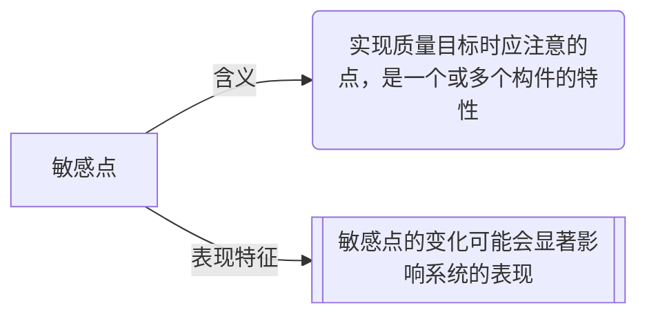
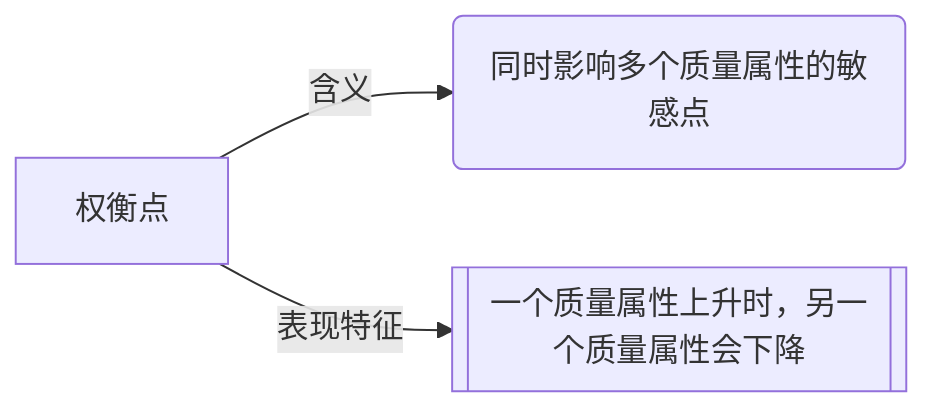

# 系统架构评估-质量属性

```mermaid
flowchart LR
A["敏感点"]-->|含义|A1("实现质量目标时应注意的点，是一个或多个构件的特性")
A-->|表现特征|A2[["敏感点的变化可能会显著影响系统的表现"]]
```

```mermaid
flowchart LR
A["权衡点"]-->|含义|A1("同时影响多个质量属性的敏感点")
A-->|表现特征|A2[["一个质量属性上升时，另一个质量属性会下降"]]
```

```mermaid
flowchart LR
A["风险点"]-->|含义|A1("架构设计中潜在的、存在问题的架构策略带来的隐患")
```

```mermaid
flowchart LR
A["非风险点"]-->|含义|A1("那些经过评估确认不会对系统造成潜在威胁和不利的点")
```

