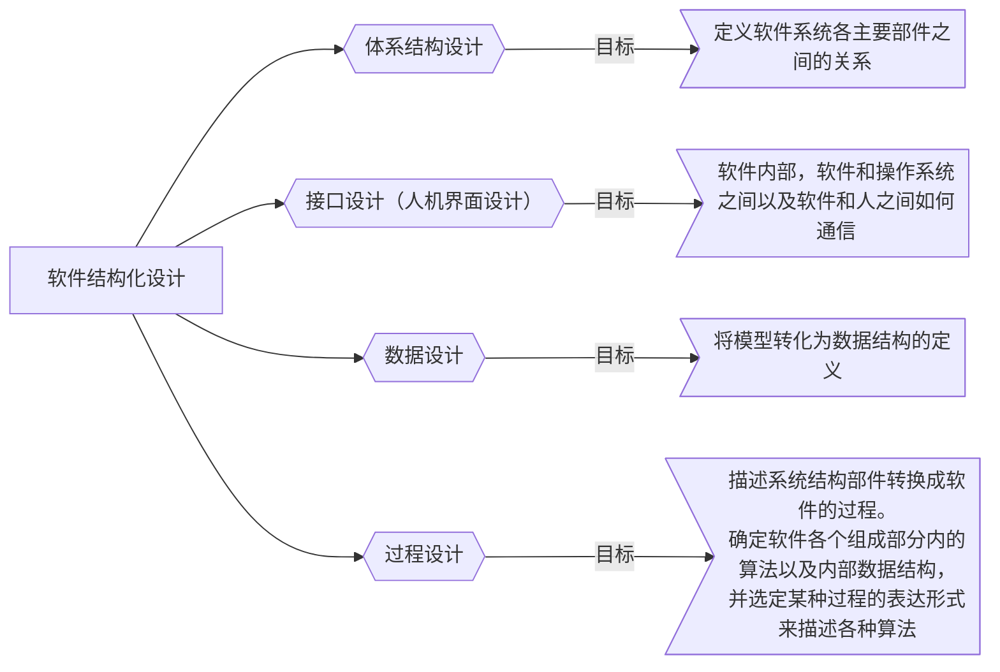

# 软件结构化设计

```mermaid
flowchart LR

A["软件结构化设计"]
A-->A1{{"体系结构设计"}}-->|目标|A11>"定义软件系统各主要部件之间的关系"]
A-->A2{{"接口设计（人机界面设计）"}}-->|目标|A21>"软件内部，软件和操作系统之间以及软件和人之间如何通信"]
A-->A3{{"数据设计"}}-->|目标|A31>"将模型转化为数据结构的定义"]
A-->A4{{"过程设计"}}-->|目标|A41>"描述系统结构部件转换成软件的过程。
确定软件各个组成部分内的算法以及内部数据结构，
并选定某种过程的表达形式来描述各种算法"]
```

